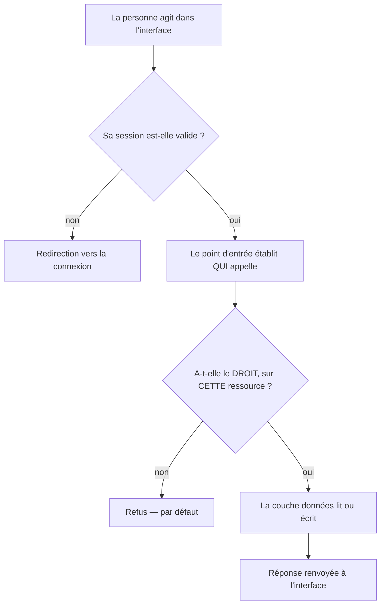

# ImpactOS — vue d'ensemble

Ce document donne la **vision globale** du projet : ce que fait le produit, qui
l'utilise, quelles sont ses grandes zones, comment une action traverse le
système, et comment le code est rangé. C'est le document à lire en premier pour
comprendre — avant d'entrer dans les détails.

Pour la suite, selon ce que tu cherches :

| Ce que tu veux | Où aller |
|---|---|
| Installer, coder, respecter les règles | [`CONTRIBUTING.md`](CONTRIBUTING.md) |
| Le produit en profondeur (stratégie, roadmap, piliers) | [`PRODUCT.md`](PRODUCT.md) |
| La technique en profondeur (auth, données, intégrations) | [`docs/ARCHITECTURE.md`](docs/ARCHITECTURE.md) |
| Où doit vivre chaque morceau de code | [`docs/MVC_REFACTOR.md`](docs/MVC_REFACTOR.md), [`docs/SERVER_LAYERS.md`](docs/SERVER_LAYERS.md) |
| Les droits et permissions | [`docs/AUTHZ_CURRENT_STATE.md`](docs/AUTHZ_CURRENT_STATE.md) |
| La sécurité : ce qui est corrigé, ce qui reste | [`docs/SECURITY_AUDIT_REGISTER.md`](docs/SECURITY_AUDIT_REGISTER.md) |

---

## 1. Ce qu'est ImpactOS

Un système d'exploitation pour le développement de startups et la gestion
d'écosystèmes d'innovation. Il sert à **découvrir, accompagner, suivre et
financer** des entreprises innovantes de façon structurée.

Il est né comme outil interne de Future Studio, puis s'est ouvert aux venture
studios, incubateurs, accélérateurs, investisseurs, gestionnaires de programmes
et entrepreneurs.

Ce n'est **pas** : un simple gestionnaire de tâches, une plateforme de cours, un
CRM générique, ni un réseau social. C'est l'ensemble, connecté autour d'un même
fil : faire progresser une startup jusqu'à ce qu'elle soit prête à lever des
fonds.

## 2. Les cinq piliers

Tout le produit s'organise autour de cinq piliers. Une fonctionnalité qui n'en
sert aucun ne doit pas être développée.

| Pilier | À quoi il sert | Public principal |
|---|---|---|
| **Operations OS** | Le travail interne : tâches, standups, rétrospectives, blocages, projets, rapports | Personnel et gestionnaires |
| **Program OS** | Les programmes d'incubation : curriculum, sessions, livrables, participants, progression | Gestionnaires, participants |
| **Venture OS** | Le parcours de la startup : étapes, jalons, livrables, préparation à l'investissement | Fondateurs, coachs |
| **Investor OS** | La vision investisseur : découverte, pipeline, due diligence, portefeuille | Investisseurs |
| **Ecosystem OS** | Le réseau : annuaire, opportunités, partenariats *(vision long terme)* | Tout l'écosystème |

## 3. Qui utilise l'application

Chaque type d'utilisateur dispose de sa propre zone, sous son propre préfixe
d'adresse.

| Rôle | Zone | Ce qu'il fait |
|---|---|---|
| Super administrateur | `/admin` | Maîtrise la plateforme entière : programmes, projets, personnel, investisseurs, finance, sécurité |
| Gestionnaire de programme | `/pm` | Pilote les programmes et projets qui lui sont attribués, relit les rapports |
| Personnel | `/staff` | Dépose ses rapports hebdomadaires, suit ses tâches et blocages |
| Participant | `/participant` | Suit son programme, ses livrables, sa progression, ses certificats |
| Facilitateur | `/facilitator` | Anime et facilite un programme |
| Investisseur | `/investor` | Consulte le pipeline, les opportunités, la due diligence, son portefeuille |
| Finance | `/finance` | Suit budgets et transactions |
| CRM | `/crm` | Gère les contacts, les adhésions, la chronologie |
| Équipe | `/team` | Espace de travail d'une équipe |

Deux rôles **contextuels** n'ont pas de zone dédiée : **fondateur** et **membre
de venture**. Ils existent à l'intérieur des surfaces Venture et Programme,
attachés à une venture précise.

À cela s'ajoutent des surfaces transverses : la **plateforme de formulaires**
(réponses, modules, collections, soumissions) et un **sélecteur de contexte** qui
liste tous les espaces légitimes d'une personne.

## 4. La carte des grands domaines

La vue du super administrateur est la plus complète et sert de référence pour se
repérer :

| Domaine | Contenu |
|---|---|
| Tableau de bord | Vue d'ensemble consolidée |
| CRM | Contacts, adhésions, chronologie, doublons, utilisateurs en attente, import en masse |
| Communication | Messagerie, annonces, formulaires |
| Programmes | Tous les programmes, création, progression, curriculum |
| Ventures | Toutes les ventures, jalons, livrables, sessions, rapports de parcours |
| Investisseurs | Gestion, tableau de bord, revue, campagnes, relations |
| Finance | Budgets, transactions, synchronisation avec les tableurs |
| Opérations | Plateau interne, projets, tâches, blocages, standup, rétrospective |
| Rapports | Rapports de programme, rapports internes, indicateurs |
| Connaissances | Base de connaissances, intelligence |
| Formation (LMS) | Cours, ressources, évaluations, certificats |
| Sécurité | État de sécurité, journaux d'audit, résumé des accès, permissions |
| Paramètres | Intégrations, réglages système |

Hors des zones d'administration, on trouve aussi les surfaces **publiques** :
connexion, inscription, invitations, remplissage d'un formulaire partagé,
vérification d'un certificat.

## 5. Le chemin d'une action

Aucune action n'atteint les données directement. Chaque requête traverse les
mêmes étapes, dans cet ordre :

Deux idées à retenir :

1. **La session seule ne suffit pas.** Être connecté ouvre la porte ; un droit
   précis et un périmètre décident ensuite.
2. **Le refus est le comportement par défaut.** Dès qu'un doute existe — droit
   illisible, ressource ambiguë — l'accès est refusé, jamais accordé par
   accident.

## 6. Le modèle de droits, expliqué simplement

Les droits d'une personne se construisent **en couches**, du plus général au plus
particulier :

1. **L'identité** — le type de personne (rôle).
2. **L'éligibilité** — un **plafond** : ce type de personne a-t-il le droit
   d'approcher cette zone ? Sans réponse claire, c'est non. C'est un plafond,
   jamais une autorisation.
3. **Les droits de base** — ceux du profil d'accès par défaut, éventuellement
   remplacés par un réglage propre à la personne.
4. **Les droits de groupe** — hérités des groupes auxquels elle appartient.
5. **Les droits personnels** — accordés directement à la personne, parfois avec
   une date d'expiration.

Les couches 3, 4 et 5 **s'additionnent** : c'est le niveau le plus élevé qui
l'emporte. Puis deux mécanismes tranchent :

- **Une interdiction explicite gagne toujours.** Elle ne baisse pas le niveau :
  elle **retire** le droit. Accorder à nouveau ne la contourne pas ; seul le
  retrait de l'interdiction le fait. Cette règle est verrouillée par un test.
- **Le périmètre** répond à « sur quoi ? ». Il est lu dans les attributions
  réelles (qui est membre de quoi), pas dans un cache de droits.

Enfin, la plateforme **vérifie elle-même chaque relation** au moment de servir
la donnée. Une interdiction posée dans la base ne dispense jamais du contrôle
applicatif.

## 7. Comment le code est organisé

Trois couches, avec une frontière stricte entre elles :

| Couche | Emplacement | Rôle |
|---|---|---|
| **Données** | `src/models/` | Toute la lecture et l'écriture. Une fonction nommée par requête. |
| **Contrôleurs** | `src/app/api/` | Authentifier, valider, orchestrer, façonner la réponse. Pas de requête directe. |
| **Vues** | `src/app/` (écrans), `src/components/` | Afficher, saisir, gérer l'état local. Ne touchent jamais la base. |

Deux couches serveur s'ajoutent, pour ne pas mélanger deux questions différentes :

| Couche | Emplacement | Question à laquelle elle répond |
|---|---|---|
| **Authentification** | `src/server/auth/` | « Qui appelle ? » — session, cookie, mot de passe |
| **Autorisation** | `src/server/authz/` | « A-t-il le droit, sur cette ressource ? » — droits, périmètre |

Et une base d'infrastructure, partagée par les trois couches : `src/lib/`
(connexion à la base, traduction, envoi d'e-mails, stockage de fichiers,
intégrations).

`src/lib/` contient encore des **façades** : d'anciens fichiers qui se contentent
de réexporter ce qui a déménagé, pour que les anciens chemins d'import
continuent de fonctionner. Le nouveau code importe directement depuis les
nouveaux emplacements.

## 8. Le vocabulaire du produit

Le produit a son propre langage. Le voici, pour pouvoir lire le code et l'écran
sans hésiter.

| Terme | Ce que c'est |
|---|---|
| **Venture** | La startup accompagnée. Le cœur du produit : autour d'elle s'organisent parcours, jalons, livrables et sessions. |
| **Parcours** | Une étape structurante du chemin d'une venture. Contient plusieurs jalons. Un seul parcours est actif à la fois. |
| **Jalon** | Une unité de travail d'un parcours, contenant tâches, livrables et sessions. Les jalons se libèrent un par un. |
| **Livrable** | Ce que la venture doit produire pour un jalon. Soumis, puis évalué. |
| **Session** | Un rendez-vous planifié avec la venture. |
| **Mémo** | La note qui accompagne une session et part vers la venture. |
| **Rapport de parcours** | Le bilan remonté au super administrateur. |
| **Rapport opérationnel** | Le compte rendu hebdomadaire d'un membre du personnel. |
| **Standup** | Le point hebdomadaire d'une personne sur ses tâches. |
| **Rétrospective** | Le bilan de fin de semaine qui réconcilie les tâches. |
| **Blocage** | Un obstacle déclaré sur une tâche. Seul son auteur peut le lever. |
| **Programme** | Un programme d'incubation : curriculum, sessions, participants. |
| **Cohorte** | Un groupe de participants d'un programme. |
| **Équipe** | Un groupe de travail disposant de son propre espace. |
| **Contact** | Une personne au fichier : rôle, adhésions, historique. |
| **Réponse / soumission** | Une réponse à un formulaire de la plateforme, et son dépôt. |
| **Profil d'accès** | Le jeu de droits par défaut attaché à un type de personne. |
| **Responsabilité** | Un rôle nommé, porteur de droits, attribuable à une personne. |
| **Droit** | Un pouvoir précis sur une zone, à un certain niveau. |
| **Éligibilité** | Le plafond : ce type de personne peut-il seulement approcher la zone ? |
| **Périmètre** | Sur quelles ressources précises le droit s'applique. |
| **Interdiction** | Un retrait explicite de droit sur une personne. Elle l'emporte sur toute autorisation. |

## 9. Ce que le système garantit

- **Français et anglais obligatoires.** Chaque texte visible existe dans les
  deux langues. Un texte anglais en dur est un défaut.
- **Le thème s'adapte.** Clair et sombre, via des variables de couleur partagées.
  Aucune couleur écrite en dur.
- **Les refus sont prudents.** En cas de doute sur un droit ou un périmètre, la
  réponse est non.
- **Rien ne se supprime à la légère.** Les données financières et d'audit se
  marquent plutôt qu'elles ne disparaissent.
- **Les frontières entre couches sont surveillées**, par des tests et non par la
  bonne volonté.

En une phrase : *une personne se voit attribuer un parcours de startup, on lui en
libère les jalons un à un, elle produit ses livrables, et tout ce qu'elle fait
remonte structuré — sans jamais voir plus que la part du travail qui la
concerne.*
