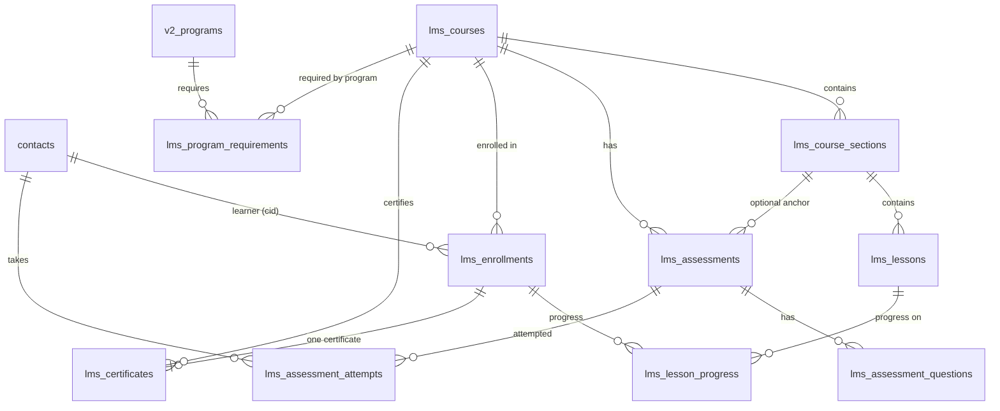

# LMS Architecture — ImpactOS Learning Management System

> Phase 1 foundation (implemented). Phase 3 learner experience, Phase 4 assessments,
> and Phase 5 certificates are implemented on top of it.
> This document is the source of truth for the LMS domain (course builder, learner
> experience, assessments, certificates, and the future program integration).

## 1. Placement

The LMS is a **new domain inside ImpactOS**. It reuses existing users, authentication,
authorization, i18n, design system, and API conventions. It does **not** reuse or force
Program entities into LMS roles.

```
ImpactOS
│
├── Existing Core
│   ├── Users (contacts) · Authentication (user_sessions) · Authorization (PERMISSION_MODULES)
│   ├── Programs (v2_programs) · Participants (participant_programs) · Sessions (v2_sessions)
│   └── Shared infrastructure (db.js, audit, i18n, ui components, storage)
│
└── LMS
    ├── lms_courses → lms_course_sections → lms_lessons (YouTube video)
    ├── lms_enrollments + lms_lesson_progress
    ├── lms_assessments → lms_assessment_questions → lms_assessment_attempts
    ├── lms_certificates (Phase 5 — one per completed enrollment)
    └── lms_program_requirements (Program → Course link)
    └── (certificates: intentionally deferred — see §8)
```

Key relationship: **Program → Learning Requirement → Course**. A Course is **not owned** by a
Program; a Course can be sold, assigned to any number of Programs, or assigned to a learner
directly.

## 2. Domain model



### 2.1 lms_courses

| Column | Type | Notes |
|---|---|---|
| id | UUID PK | `gen_random_uuid()` |
| slug | TEXT UNIQUE | human-readable identifier for future public URLs |
| title | TEXT NOT NULL | |
| description | TEXT | |
| thumbnail_url | TEXT | image reference (Vercel Blob / CDN), not a blob |
| status | TEXT CHECK | `draft` \| `published` \| `archived` (default `draft`) |
| visibility | TEXT CHECK | `public` \| `private` (default `public`) |
| is_free | BOOLEAN | default TRUE |
| price | DECIMAL(10,2) | only meaningful when `is_free = FALSE`; payment is a future phase |
| created_by | TEXT | `contacts.cid` or `'system'`; **no FK** (matches `learning_paths.created_by` convention) |
| created_at / updated_at | TIMESTAMPTZ | default `timezone('utc'::text, now())` |

Indexes: `(status)`, `(visibility)`, `(created_by)`.

### 2.2 lms_course_sections

| Column | Type | Notes |
|---|---|---|
| id | UUID PK | |
| course_id | UUID NOT NULL FK → lms_courses | `ON DELETE CASCADE` (no orphaned sections) |
| title | TEXT NOT NULL | |
| description | TEXT | |
| position | INTEGER | default 0 |
| created_at / updated_at | TIMESTAMPTZ | |

Constraint: `UNIQUE (course_id, position)` — predictable ordering (also serves course_id lookups).

### 2.3 lms_lessons

| Column | Type | Notes |
|---|---|---|
| id | UUID PK | |
| section_id | UUID NOT NULL FK → lms_course_sections | `ON DELETE CASCADE` |
| title | TEXT NOT NULL | |
| description | TEXT | |
| position | INTEGER | default 0 |
| is_required | BOOLEAN | default TRUE |
| content_type | TEXT CHECK | V1: `video` only (extend via ALTER in later phases) |
| youtube_video_id | TEXT | **YouTube identifier only** — no video storage, transcoding, or DRM |
| duration_minutes | INTEGER | |
| created_at / updated_at | TIMESTAMPTZ | |

Constraint: `UNIQUE (section_id, position)`.

### 2.4 lms_enrollments

| Column | Type | Notes |
|---|---|---|
| id | UUID PK | |
| course_id | UUID NOT NULL FK → lms_courses | `ON DELETE CASCADE` |
| user_cid | TEXT NOT NULL FK → contacts(cid) | **existing ImpactOS identity** — no lms_users |
| source | TEXT CHECK | `admin` \| `program` \| `self` \| `purchase` (payment is a future phase; `purchase` is architectural) |
| status | TEXT CHECK | `active` \| `completed` \| `suspended` |
| program_id | TEXT | informational: the program that triggered a `program` enrollment (no FK — see §8) |
| enrolled_at | TIMESTAMPTZ | default now |
| completed_at | TIMESTAMPTZ | |

Constraint: `UNIQUE (course_id, user_cid)` — one enrollment per learner+course. Index: `(user_cid)`.

### 2.5 lms_lesson_progress

| Column | Type | Notes |
|---|---|---|
| id | UUID PK | |
| enrollment_id | UUID NOT NULL FK → lms_enrollments | `ON DELETE CASCADE` |
| lesson_id | UUID NOT NULL FK → lms_lessons | `ON DELETE CASCADE` |
| status | TEXT CHECK | `not_started` \| `in_progress` \| `completed` |
| completed_at | TIMESTAMPTZ | |
| created_at / updated_at | TIMESTAMPTZ | |

Constraint: `UNIQUE (enrollment_id, lesson_id)` — no duplicate progress rows. Index: `(lesson_id)`.
Intentionally NOT keyed on `user_cid` alone: progress belongs to an enrollment, keeping the LMS
domain cleanly separated from Program progress (`v2_progress`).

### 2.6 lms_assessments

| Column | Type | Notes |
|---|---|---|
| id | UUID PK | |
| course_id | UUID NOT NULL FK → lms_courses | `ON DELETE CASCADE` |
| section_id | UUID NULL FK → lms_course_sections | `ON DELETE CASCADE`; **NULL = course-level assessment** (course creator decides placement) |
| title | TEXT NOT NULL | |
| description | TEXT | |
| position | INTEGER | default 0 |
| is_required | BOOLEAN | default TRUE |
| pass_mark | INTEGER | NULL = use course/global default (defined in a later phase) |
| created_at / updated_at | TIMESTAMPTZ | |

Indexes: `(course_id)`, `(section_id)`.

### 2.7 lms_assessment_questions

| Column | Type | Notes |
|---|---|---|
| id | UUID PK | |
| assessment_id | UUID NOT NULL FK → lms_assessments | `ON DELETE CASCADE` |
| question | TEXT NOT NULL | |
| question_type | TEXT CHECK | `multiple_choice` \| `true_false` |
| options | JSONB | `[{key,text}]` for MC; `[]` for true_false |
| correct_answer | JSONB | `['A']` or `['true']` / `['false']` (array keeps the model extensible) |
| points | INTEGER | default 1 |
| position | INTEGER | default 0 |
| created_at / updated_at | TIMESTAMPTZ | |

Constraint: `UNIQUE (assessment_id, position)`.

### 2.8 lms_assessment_attempts

| Column | Type | Notes |
|---|---|---|
| id | UUID PK | |
| user_cid | TEXT NOT NULL FK → contacts(cid) | |
| assessment_id | UUID NOT NULL FK → lms_assessments | `ON DELETE CASCADE` |
| attempt_number | INTEGER | default 1 |
| score | INTEGER | default 0 |
| total_points | INTEGER | default 0 |
| passed | BOOLEAN | default FALSE |
| answers | JSONB | learner's submitted answers |
| started_at / completed_at | TIMESTAMPTZ | |
| created_at | TIMESTAMPTZ | |

Constraint: `UNIQUE (user_cid, assessment_id, attempt_number)` — **multiple attempts are
structurally supported** (the uniqueness is per attempt, not per user+assessment).
Index: `(assessment_id)`.

### 2.9 lms_program_requirements

| Column | Type | Notes |
|---|---|---|
| id | UUID PK | |
| program_id | TEXT NOT NULL | `v2_programs.id`; **no FK** — see §8 |
| course_id | UUID NOT NULL FK → lms_courses | `ON DELETE CASCADE` |
| title / description | TEXT | |
| position | INTEGER | default 0 |
| is_required | BOOLEAN | default TRUE |
| week_number | INTEGER | optional program context (week gate) |
| session_id | TEXT | optional program context (session anchor) |
| created_at / updated_at | TIMESTAMPTZ | |

Constraint: `UNIQUE (program_id, course_id)` — a course is required at most once per program.
Index: `(course_id)`.

### 2.10 lms_certificates (Phase 5)

| Column | Type | Notes |
|---|---|---|
| id | UUID PK | internal id — NEVER exposed as the certificate number |
| certificate_number | TEXT UNIQUE | public-facing id `CERT-<YYYY>-<NNNNNN>`; unique, stable, human-readable |
| verification_token | TEXT UNIQUE | random (24 hex); used by the public verification URL — not enumerable |
| enrollment_id | UUID NOT NULL UNIQUE FK → lms_enrollments | `ON DELETE CASCADE`; **one certificate per completed enrollment** (DB-enforced) |
| course_id | UUID NOT NULL FK → lms_courses | `ON DELETE CASCADE` |
| user_cid | TEXT NOT NULL FK → contacts(cid) | existing ImpactOS identity — no second identity system |
| learner_name | TEXT NOT NULL | authoritative snapshot at issuance (historical integrity) |
| course_title | TEXT NOT NULL | authoritative snapshot at issuance (historical integrity) |
| issued_at | TIMESTAMPTZ | default now; the real issuance moment |
| status | TEXT CHECK | `valid` \| `revoked` (V1); records are NEVER deleted |
| revoked_at | TIMESTAMPTZ | set on revocation |
| created_at / updated_at | TIMESTAMPTZ | |

Indexes: `(user_cid)`, `(course_id)`, `(status)`.

### 2.11 lms_section_resources (Phase 8)

| Column | Type | Notes |
|---|---|---|
| id | UUID PK | |
| section_id | UUID NOT NULL FK → lms_course_sections | `ON DELETE CASCADE` — the material dies with its section (no orphan rows) |
| kind | TEXT CHECK | `video` \| `document` |
| title | TEXT NOT NULL | |
| description | TEXT | what the resource is / how to use it |
| url | TEXT | where the material lives: an external link OR the uploaded file's public URL — required by the service |
| source | TEXT CHECK | `link` \| `upload` (default `link`) — the origin of `url` |
| storage_path | TEXT | object path in the `lms-session-resources` bucket (historical name, deliberately kept); NULL for links (deletion handle) |
| file_name / file_size / mime_type | TEXT / BIGINT / TEXT | original filename, bytes and mime type of an upload |
| is_recommended | BOOLEAN | default FALSE — the "recommended for this section" signal |
| recommendation_note | TEXT | why it is recommended (coach/PM guidance) |
| position | INTEGER | default 0 |
| created_by | TEXT | `contacts.cid` or `system` |
| created_at / updated_at | TIMESTAMPTZ | |

Indexes: `(section_id)`, `(section_id, is_recommended)`.

Material used to hang off a PROGRAM session (`lms_session_resources`, no FK on
`program_id` / `session_id`); `20260918_lms_section_resources.sql` created this
table and dropped that one (§7).

### 2.12 lms_coaching_requests (Phase 8)

| Column | Type | Notes |
|---|---|---|
| id | UUID PK | |
| user_cid | TEXT NOT NULL FK → contacts(cid) | the learner (existing ImpactOS identity) |
| program_id | TEXT | `v2_programs.id`; **no FK**; resolved server-side |
| course_id | UUID FK → lms_courses | `ON DELETE CASCADE` |
| lesson_id | UUID FK → lms_lessons | `ON DELETE SET NULL`; optional "right here" context |
| timing | TEXT CHECK | `before` \| `during` \| `after` |
| topic / message | TEXT | optional learner input |
| status | TEXT CHECK | `pending` \| `accepted` \| `declined` \| `completed` \| `cancelled` |
| handled_by | TEXT | `contacts.cid` of the staff member who decided |
| handled_at | TIMESTAMPTZ | |
| response_note | TEXT | staff answer the learner sees |
| created_at / updated_at | TIMESTAMPTZ | |

Indexes: `(user_cid)`, `(program_id, status)`, `(course_id)`.

## 3. Conventions

- **IDs**: UUID PKs via `gen_random_uuid()` (matches `v2_programs`/`v2_sessions` style). User
  references are `TEXT` → `contacts.cid` (matches `participant_programs.participant_id`).
- **Timestamps**: `TIMESTAMPTZ NOT NULL DEFAULT timezone('utc'::text, now())`. The codebase has
  **no trigger convention** — service code must set `updated_at` explicitly on updates.
- **Enums**: TEXT columns with CHECK constraints (matches `v2_programs.grading_mode`).
  The JS vocabulary lives in `src/lib/lms/constants.js`; the schema test
  (`src/__tests__/lms-foundation.test.js`) guards against drift.
- **Ordering**: `position INTEGER NOT NULL DEFAULT 0` with `UNIQUE (parent_id, position)`.

### 3.1 Code layout — Model / Controller / View (MVC)

The LMS module follows the app-wide MVC layering described in `docs/ARCHITECTURE.md`
(route handlers = backend controllers, pages/components = frontend views, data +
domain logic = `src/lib/` modules):

```
src/models/lms/*.js             → MODEL   — tables 2.1–2.10, domain rules, SQL
                                  (src/lib/lms/*.js are facades re-exporting them)
src/app/api/lms/**/route.js      → CONTROLLER — thin HTTP glue
src/components/lms/*.js          → VIEW    — client components (fetch controllers)
src/app/{admin/lms,participant/learning,courses,verify}/** → VIEW pages
```

Rules (enforced by convention + the route/service test suites):

- **Controllers never contain SQL or domain rules.** They parse the HTTP request,
  run the guard (`requireAuth` / `requireAuthorization("lms", …)`), delegate to one
  or more service functions, and shape the response. Validation of request *shape*
  may live here; domain validation lives in the model.
- **Model modules own all `db.execute` calls and never parse HTTP requests or run
  auth guards.** They accept primitives (`courseId`, `userCid`, …), throw `LmsError`
  (i18n key + status, `src/lib/lms/errors.js`) and return plain data. The only HTTP
  coupling in that file is `lmsErrorResponse()`, a controller-side mapper (mirroring
  how `lib/auth.js` / `lib/authorization` return `NextResponse` guards) — it is never
  imported by other model modules.
- **Views never touch `src/lib/db` or the model services.** Components and pages
  call `/api/lms/*` controllers only; server-side guards remain the security
  boundary (see §4). Score/status/progress decisions are always recomputed
  server-side (`src/lib/lms/scoring.js`, `learning.js`) — the client only renders
  what the controller returns.

## 4. Authorization

- New module `lms` in `PERMISSION_MODULES` (`src/lib/auth.js`) with capabilities
  `view, create, edit, delete`.
- **Super admin**: automatically gets full LMS access through every layer — the V3 resolver's
  in-memory `buildSuperAdminMatrix()`, `hasCapabilityV2`'s SA bypass, and (after re-running the
  seeds) the `role_capabilities` / `access_profile_capabilities` rows.
- **Delegation to staff** (product decision): no default LMS capability for the "Staff Default"
  profile. A super admin grants `lms.*` capabilities to a specific staff member through the
  existing Permission Manager (`/admin/engineering/permissions`) — per-user grants
  (`user_capabilities`) or a custom access profile. No new global role was created.
- **Route guard for future phases**: use `requireAuthorization("lms", "…")` from
  `src/lib/authorization` (the canonical resolver). It is capability-only for `lms`
  (eligibility-gated for the internal roles).
- **Server-side only**: future mutations must call these guards in the route handler. Frontend
  visibility is never a security boundary.

## 5. API conventions for future phases

Follow existing ImpactOS conventions (see `docs/API.md`, `docs/MODULES.md`):

- Route handlers in `src/app/api/lms/**/route.js`; prefer the `createHandler` wrapper
  (`src/lib/api/createHandler.js`) or the standard
  `initDb() → requireAuth/requireAuthorization → db.execute({sql,args}) → NextResponse.json({success,…})` shape.
- Business logic in `src/lib/lms/` service modules (never inline-heavy route files).
- Response shape `{ success: boolean, error?: string }`; error strings are i18n keys
  (e.g. `errors.authRequired`). SQL uses `?` placeholders (translated to `$N` by `db.execute`).
- Every user-visible string goes through `t()` with `en/` + `fr/` locale entries
  (see `AGENTS.md`). Planned namespace: `lms.*` in a new `src/locales/en/lms.json` + `fr/lms.json`.

## 6. Route map

| Route | Status | Purpose |
|---|---|---|
| `/api/lms/courses` + `/api/lms/courses/[id]` | ✅ Phase 2 | course + section + lesson CRUD (admin) |
| `/api/lms/courses/[id]/publish` · `/archive` | ✅ Phase 2 | status transitions (admin) |
| `/api/lms/sections/*` · `/lessons/*` · `/assessments/*` · `/questions/*` | ✅ Phase 2 | content authoring (admin) |
| `/api/lms/enrollments` + `/api/lms/courses/[id]/enrollments` | ✅ Phase 3 (minimal enabler) | admin enrollment |
| `/api/lms/my-learning` (+ `?exists=1`) | ✅ Phase 3 | learner's enrolled courses + progress; `exists=1` returns a lightweight `{ enrolled }` flag used by the shell to only surface "My Learning" for learners who have subscribed to or been assigned a course |
| `/api/lms/courses/[id]/learn` | ✅ Phase 3 | learner-scoped course view (enrollment-gated) |
| `/api/lms/lessons/[lessonId]/complete` | ✅ Phase 3 | idempotent lesson completion |
| `/api/lms/assessments/[id]/submit` | ✅ Phase 4 | server-side scoring + attempt row |
| `/api/lms/certificates` | ✅ Phase 5 | learner's own certificates (auth) |
| `/api/lms/certificates/[id]` | ✅ Phase 5 | ownership-scoped certificate detail (auth) |
| `/api/lms/certificates/[id]/download` | ✅ Phase 5 | server-built PDF download (auth + ownership) |
| `/api/lms/certificates/[id]/revoke` | ✅ Phase 5 | minimal admin revocation (`lms.edit`) |
| `/api/verify/certificate/[token]` | ✅ Phase 5 | PUBLIC verification — public fields only, no auth |
| `/verify/certificate/[token]` (page) | ✅ Phase 5 | public verification page |
| `/api/lms/program-requirements` + `[id]` | ✅ Phase 6 | Program → Course links (list/attach/update/detach) + auto-enrollment |
| `/api/public/courses` + `[slug]` | ✅ Phase 7 | public catalogue + detail (marketing-safe) + free self-enrollment (`source 'self'`). A paid course's detail also carries the public address of the active Execution that sells it (`checkout`), so the website's buy links follow the course ↔ Execution link |
| `/api/contacts/[cid]/learning` | ✅ Phase 7 | CRM learning-journey trace (`contacts.view`) |
| `/api/lms/section-resources` + `[id]` | ✅ Phase 8 | section material + recommendations (`lms.view` read, `lms.edit` write) |
| `/api/lms/section-resources/upload` | ✅ Phase 8.1 | file upload + orphan cleanup for section material (`lms.edit`) |
| `/api/lms/coaching-requests` + `[id]` | ✅ Phase 8 | learner asks for coaching before/during/after a course; staff decision queue |

Phase 6/7 implementation details, deviations and the final report: `docs/PHASE6_7_REPORT.md`.

## 7. Migration & verification

- File: `supabase/migrations/20260827_lms_foundation.sql` (additive, idempotent).
- Phase 8 additions: `supabase/migrations/20260916_lms_session_resources_and_coaching.sql`
  (additive, idempotent — `lms_session_resources` + `lms_coaching_requests`).
  `lms_coaching_requests` is unchanged; the `lms_session_resources` half is
  superseded — see §13.
- Phase 8.1 additions:
  `supabase/migrations/20260917_lms_session_resource_uploads.sql` (additive,
  idempotent — `source` / `storage_path` / `file_name` / `file_size` /
  `mime_type` on `lms_session_resources`). Deliberately dated after 20260916 so
  the table exists when it runs. Superseded with that table.
- Section-resources rework:
  `supabase/migrations/20260918_lms_section_resources.sql` (additive + one
  deliberate, irreversible DROP — creates `lms_section_resources` on
  `lms_course_sections`, drops the retired `lms_session_resources`), see §13.
- Apply via the Supabase SQL editor. Then re-run the permission seeds so the live DB's
  `access_profile_capabilities` / `role_capabilities` include the new `lms` module rows:
  `GET /api/engineering/permissions/seed` and
  `GET /api/engineering/permissions/seed-access-profiles` (super admin only).
- Verification queries:

```sql
-- Entities
SELECT tablename FROM pg_tables WHERE schemaname = 'public' AND tablename LIKE 'lms_%' ORDER BY 1;
-- Constraints (should list 9 tables, incl. FK + unique constraints)
SELECT c.conrelid::regclass AS table, c.conname, c.contype
FROM pg_constraint c
WHERE c.conrelid::regclass::text LIKE 'lms_%'
ORDER BY 1, 3;
-- Indexes
SELECT tablename, indexname FROM pg_indexes WHERE tablename LIKE 'lms_%' ORDER BY 1;
-- Enrollment uniqueness smoke test (second INSERT must fail)
INSERT INTO lms_courses (title) VALUES ('Smoke') RETURNING id;
-- then INSERT INTO lms_enrollments (course_id, user_cid, source) VALUES (<id>, 'smoke-user', 'self');
-- second identical INSERT must raise a unique violation; clean up afterwards.
```

## 8. Decisions & deviations

| Topic | Decision | Rationale |
|---|---|---|
| Certificates | **Implemented in Phase 5** — `lms_certificates` (one small additive migration) | Completion stays authoritative on `lms_enrollments`; the certificate is a consequence. One certificate per completed enrollment (DB UNIQUE on enrollment_id). Snapshots of learner_name + course_title preserve historical integrity. |
| Course `price` | Column exists; payment processing out of scope | Self-enrollment must support free AND paid courses, but checkout is a future phase. |
| `program_id` no FK | `lms_program_requirements.program_id` and `lms_enrollments.program_id` are TEXT without FK | ImpactOS has a known UUID-vs-TEXT ambiguity on `v2_programs.id` (app generates `P-2026-…` TEXT ids; schema declares UUID; code casts everywhere). A live-DB FK is unsafe until the id-space is confirmed. Service layer must validate program existence. |
| Progress keyed by enrollment | `lms_lesson_progress.enrollment_id` (not `user_cid`) | Ticket §20 + clean domain separation from `v2_progress`. |
| Assessment placement | `lms_assessments.section_id` nullable | Course creator decides: section-end assessment (section_id set) or course-level (NULL). |
| Lesson flow | Ordering columns only in Phase 1 | Sequential flow is enforced by service logic in Phase 3; no schema change needed. |
| Enrollments | Strictly one row per `(course_id, user_cid)` | Ticket §20. Re-enrollment after completion needs an explicit upsert/archive policy (later phase). |
| No API routes | None created in Phase 1 | Ticket §18: only endpoints genuinely required for the foundation — none are required yet; boundaries documented here. |
| No new role | No `LMS Manager` role | Ticket §17: granular capabilities on the existing system instead. |
| No triggers | `updated_at` maintained by service code | Matches the existing codebase (no trigger convention). |

## 9. Security notes

- Unlisted YouTube is **not** DRM: storing a `youtube_video_id` makes embedding convenient but
  does not prevent extraction or sharing. Do not claim otherwise in the UI or docs.
- Every LMS mutation must be guarded server-side with `requireAuthorization("lms", …)`;
  enrollment/access checks for the learner experience belong to the learner phase.
- Do not introduce RLS-only gating: app-level checks are the ImpactOS convention
  (`docs/ARCHITECTURE.md`, `.ai/PROJECT.md` rule 10).

## 10. Learner experience (Phase 3)

### Access model

User → valid `lms_enrollments` row → Course → Access. Learner endpoints use `requireAuth()`
(any authenticated user) and then derive access **server-side from the enrollment table** —
never from client-supplied course/enrollment IDs and never from `lms.*` capabilities (learners
have none). A non-enrolled user gets 403 even if they know the course ID. Draft courses are
never exposed to learners; archived courses remain accessible to enrolled learners.

- **"My Learning" visibility**: the sidebar entry only appears once the learner has at least one
  usable enrollment (source `self`, `admin`, `program` or `purchase`; `suspended` rows do not
  count). The shell asks `/api/lms/my-learning?exists=1` on **every personal surface**
  (`member`, `founder`, `participant`, `team`) and re-asks on each navigation inside the shell,
  so the door opens as soon as an enrollment exists.
  The door is deliberately **not** keyed off a role or off program participation: a subscriber
  coming from the public catalogue holds an `lms_enrollments` row and belongs to no program, so a
  role/relationship-derived menu left them with a dashboard-only sidebar (fixed — the entry is
  added inside the personal branch from the confirmed `exists=1` answer). The header context
  switcher (`/api/workspaces` → `contexts.learning`) is the second, equivalent door.

### Progress

- Storage: `lms_lesson_progress` (one row per `(enrollment_id, lesson_id)`, unique —
  completion is idempotent; a second click never duplicates the row).
- Formula (single, deterministic — matches the future completion engine):
  `percent = round(completed required components / total required components × 100)`
  where a component is a required lesson (completed via `lms_lesson_progress`) or a
  required assessment (counts once the learner has **passed** it — Phase 4). Optional
  lessons and optional assessments never block completion. Edge cases: all-optional
  course completes when every lesson is done; a course with zero lessons/required
  components is 0%.
- Resume/Continue: the first lesson in section/lesson order whose progress is not `completed`
  (`findContinueLesson`). Never-started → first lesson; in-progress → next incomplete;
  completed → completion state (enrollment `status = 'completed'`, `completed_at` set — this
  is the Phase 5-compatible completion state; certificates are NOT issued here).
- Course completion is stored on the enrollment; section progress is derived per request.

### Video embedding

- Embed built from the stored 11-char ID only: `https://www.youtube-nocookie.com/embed/<id>
  ?rel=0&modestbranding=1&playsinline=1&color=white&controls=0&iv_load_policy=3&disablekb=1&fs=0&enablejsapi=1`
  (privacy-enhanced domain; plays inline on mobile). No raw URL is ever shown; invalid/missing
  IDs render a graceful fallback.
- **One box, everywhere**: every surface plays a video through the same component,
  `src/components/lms/EmbeddedVideo.js` — the course presentation, the lesson authoring preview,
  the learner player, and a section resource whose link is a YouTube video (§13.1). It shows a
  poster first and only loads the embed on a click (autoplay policy), then plays it with
  `loop=1&playlist=<id>`, so the player never reaches YouTube's end screen with its suggested
  videos and its copy-link control. The authoring preview loops too: an embed that behaved
  differently while authoring was how the same video could be copied in one screen and not in
  another.
- That box renders the hardened container `src/components/lms/YouTubePlayer.js`: YouTube's own
  chrome is hidden (`controls=0`, plus no branding/cards/keyboard/native fullscreen) and the
  video sits inside a container that refuses the right-click (context) menu, drag-copy and text
  selection, with a transparent shield over the iframe so YouTube's own context menu can never
  appear. Play/pause, mute and fullscreen are our own controls, driven through the YouTube
  postMessage API.
- YouTube hides share/copy controls within its own iframe UI where supported, but **we make no
  DRM or non-copyability claims** — an Unlisted video can still be extracted or shared by a
  determined user. That limitation is intentionally documented, not hidden.
- Completion is **manual** (`Mark Lesson Complete`). YouTube playback events are deliberately
  not relied on, so a learner can never be permanently blocked by a missed event.

### Admin enrollment enabler

Phase 3 requires enrollments to exist. `POST /api/lms/enrollments` (guarded by the Phase 1
`lms.enroll` capability) enrolls a learner by cid or email, idempotently. A minimal
"Learners" modal in the course editor lists and adds learners. A full enrollment management
suite is a later phase; self-enrollment belongs to the enrollment phase.

## 11. Assessments (Phase 4)

### Access model

Same server-side chain as the learner course: authenticated user → valid `lms_enrollments`
row → assessment belongs to an accessible course/section → access. Draft courses never
serve assessments; archived courses remain takable by enrolled learners. Non-enrolled
users get 403 even when they know the assessment ID.

### Taking flow

`GET /api/lms/assessments/[id]/take` returns assessment metadata + questions (options
only — `correct_answer` is **never** exposed to learners) + the learner's attempt history.
`POST /api/lms/assessments/[id]/submit` validates every answer against the configured
questions, computes the score and pass/fail **server-side** (`src/lib/lms/scoring.js`),
persists an attempt, and returns the result + refreshed course progress.

### Scoring (single, deterministic)

- `percent = round(correct answers / total questions × 100)` — one point per question
  (the `points` column is persisted but does not weight V1 scoring).
- Rounding is `Math.round`.
- `PASS` when `percent >= pass_mark`; a NULL `pass_mark` defaults to **70**.
- Answer validation (ticket §25): every question must be answered exactly once; question
  IDs must belong to the assessment; MC answers must be an author-configured option key;
  TF answers must be `true`/`false`. The client cannot submit arbitrary values, a fake
  score, or a fake pass state.

### Attempts

- Unlimited retries; **every** attempt is persisted in `lms_assessment_attempts`.
- `attempt_number` is derived server-side inside a transaction
  (`COALESCE(MAX(attempt_number), 0) + 1`); the Phase 1 `UNIQUE(user_cid,
  assessment_id, attempt_number)` constraint guards concurrent double-submissions
  (one retry on conflict). The client never supplies the attempt number.
- A passed assessment stays passed; later failures never overwrite historical attempts.
- Partially completed in-session answers are **not** persisted — a refresh before submit
  returns to the entry view without creating a false attempt.

### Course completion integration

- Passing an assessment never completes lessons and vice versa (`lms_lesson_progress` and
  `lms_assessment_attempts` stay separate).
- `computeCourseProgress` counts required assessments that have been passed toward
  completion; optional assessments never block. When all required lessons are done AND
  all required assessments are passed, the enrollment transitions to `completed`
  (`completed_at` set) — the Phase 5-compatible state. Certificates are NOT issued here.
- "Continue Course" after a pass returns the learner to the course overview; the
  certificate flow belongs to Phase 5.

## 12. Certificates (Phase 5)

### Completion engine (single source of truth)

Course completion is **not** recomputed anywhere new. `computeCourseProgress`
(`src/lib/lms/learning.js`) remains the ONLY completion calculation, and every
surface (My Learning, course overview, player, lesson completion, assessment
submission) consumes its result. When a course becomes complete:

1. `finalizeCourseCompletion` (the only place an enrollment transitions to
   `completed`) persists `lms_enrollments.status = 'completed'` — the first
   `completed_at` wins (COALESCE); the state never moves backwards.
2. The same finalizer calls `ensureCertificateForEnrollment`
   (`src/lib/lms/certificates.js`) — idempotent, one certificate per completed
   enrollment.
3. Read surfaces (My Learning, course overview) lazily issue certificates for
   enrollments completed before this phase shipped.

Optional lessons/assessments never block completion; a later failed assessment
retake never invalidates an existing completion (an assessment stays "passed"
once any attempt passed, and the persisted enrollment state is authoritative).

### Certificate record

`lms_certificates` (§2.10) is linked to the existing learner (`contacts.cid`),
course, and enrollment — no second identity system. It snapshots `learner_name`
and `course_title` at issuance so later renames never rewrite an issued
certificate (historical integrity). The public-facing `certificate_number`
(`CERT-<YYYY>-<NNNNNN>`, per-year count) is unique and human-readable but NEVER
the internal DB id; a random `verification_token` powers the public URL.

### Issuance & duplicate prevention

- Issuance is server-side only: `issueCertificate` requires a persisted
  `completed` enrollment (409 otherwise). A client can never POST a fake
  completion flag.
- DB `UNIQUE (enrollment_id)` + an existing-record check make issuance
  idempotent: a retry returns the existing certificate. `certificate_number`
  collisions under concurrency retry with a fresh number.

### Status & revocation (V1)

Status is `valid` → `revoked` (minimal). Revocation is a single admin endpoint
(`POST /api/lms/certificates/[id]/revoke`, guarded by `lms.edit`; super admin
bypasses through the resolver). Revocation NEVER deletes the record — the
historical record stays auditable and public verification reflects REVOKED.

### Public verification

`GET /api/verify/certificate/[token]` (no auth) resolves the token (or the
certificate number for convenience) and returns ONLY the deliberately public
fields: certificate number, learner name, course title, issue date, status.
Never emails, user ids, enrollment data, internal ids, or the token itself.
The page `/verify/certificate/[token]` renders valid/revoked with text labels
(never color alone).

### PDF download

`GET /api/lms/certificates/[id]/download` (auth + ownership) builds the PDF
server-side with the existing `jspdf` dependency from the authoritative record
(`src/lib/lms/certificate-pdf.js`) — the browser can never supply arbitrary
name/course/date/id content. Revoked certificates cannot be downloaded. Labels
are English for V1; the builder accepts a `labels` map + `lang` so
multi-language PDFs extend cleanly later. No email delivery in this phase.

### Learner surface

Certificates are discoverable from My Learning (completed course cards show
"Certificate available" + View) and from the course overview (CertificateCard
with the full certificate + Download). The existing `/participant/certificates`
page belongs to the PROGRAM certificate system (`participant_programs.
certificate_issued`) — LMS certificates are intentionally kept separate until
the Program ↔ LMS integration phase.

## 13. Section resources, recommendations & coaching requests (Phase 8)

Two additions that give a learner somewhere to find support: the material attached
to the course sections they are taking, and a queue for asking staff for coaching.

### 13.1 Section resources

A COURSE SECTION carries its own material as ROWS in
`lms_section_resources` — videos and documents, each with an optional
`is_recommended` flag and a `recommendation_note`. The feature began attached to
a PROGRAM session; the new table and the drop of `lms_session_resources` are in
`20260918_lms_section_resources.sql` (§7).

- **Authoring** (`lms.edit`): one controlled form serves the surface that manages
  a section's material. `src/components/lms/SectionResourcesEditor.js` renders the
  list and the add/edit form and owns no persistence; the section panel
  (`SectionResourcesPanel`, rendered inside each section of the course editor)
  fetches the section's resources and saves every change immediately through
  `/api/lms/section-resources`. Files are uploaded to storage as soon as they are
  picked (the only way to get a URL), so an abandoned form discards its unsaved
  uploads (`discardUnsavedUploads`, which never touches a saved object).
- **Two origins, one row**: a resource is either an external link
  (`source = 'link'`) or a file uploaded through ImpactOS
  (`source = 'upload'`). Uploads are a deliberate two-step:
  `POST /api/lms/section-resources/upload` (multipart) stores the object and
  returns `{ url, storage_path, file_name, file_size, mime_type, kind }`, which
  the caller then saves on the resource. That keeps the row and the object in
  sync, and lets the same metadata be edited like any other field.
  Bucket: `lms-session-resources` — the historical name is deliberately kept so
  no object from the retired feature is orphaned (auto-created on first use,
  service-role upload — same boundary as `course-thumbnails`). New objects live
  under `sections/<course>/<section>/<timestamp>-<name>`.
- **Limits**: documents (PDF / Office / OpenDocument / text / images) up to
  **5 MB** — the app-wide ceiling (see `src/lib/storage.js`); videos (mp4 / webm
  / mov / m4v) up to **25 MB**. Enforced server-side before storage, and mirrored
  in the picker for instant feedback (`src/lib/lms/constants.js` is the shared
  source of both rules). The picker accepts a dropped file as well as a click.
- **Inline preview (learner)**: `ResourcePreview` shows an uploaded image
  directly and reveals a PDF (framed) or a video (player) on demand — never
  automatically, and **never for external links** (a third-party page may refuse
  to be framed; a broken embed is worse than a plain link). `resourcePreviewKind`
  (in `src/lib/lms/constants.js`) decides, falling back to the filename when the
  browser reported no mime type. Everything else opens in a new tab.
- **Uploaded files are signed, not linked**: the learner surface reads material
  through `learnerSectionResourcesByCourse`, which swaps the permanent public
  URL of an upload for a short-lived signed one (6 h —
  `SECTION_RESOURCE_URL_TTL_SECONDS`) and drops the storage path; the staff read
  (`listSectionResourcesByCourse`) keeps the stored values, where handing a link
  to a colleague is acceptable. This is §10's rule applied to material: what the
  learner watches or opens inside ImpactOS must not become a link they can keep.
  A file storage refuses to sign comes back with a null `url`, so the card says
  it is unavailable instead of rendering a dead link. Note the limit: signing
  bounds what a copied link is worth, it does not prevent someone from saving the
  file while it plays.
- **No orphans**: deleting a resource deletes its stored object; replacing a
  file deletes the previous one; an upload cancelled before saving is removed
  through `DELETE /api/lms/section-resources/upload?path=…`. All of these are
  best-effort — the database stays authoritative, a storage hiccup never blocks
  the row from being saved or deleted. Only paths under `sections/` are ever
  accepted as a deletion target (`isManagedStoragePath`).
- **Reading** (`lms.view`): `GET /api/lms/section-resources?section_id=…`.
- **Surfaces**: material is authored in the section panel of the LMS course
  editor; the admin course presentation (`CourseView`) and the learner course
  overview (`LearnerCourse`) attach each section's resources to that section
  (`section.resources`) and render them with
  `src/components/lms/SectionResourcesList.js`, which shows recommendations first
  (note included), then the remaining material, with the filename and size for
  uploads. The Program Manager workspace no longer shows or manages material, and
  the participant program payload no longer carries it.
- **A video resource is played, not linked**: when a link resource points at a
  YouTube video, the card shows its title as plain text and plays the video
  through the same embed a lesson uses (§10) — a video we show inside the LMS
  must not be handed to the learner as a copyable link just because it was
  attached to a section rather than to a course. Every other link still opens in
  a new tab: a third-party page may refuse to be framed, and a broken embed
  would be worse than the plain link.
- Legitimacy rules: `title` and an http(s) `url` are required (a link-less
  resource is not a resource); an unknown `kind` is rejected; a recommendation
  note is only stored when the resource is actually flagged. The legacy
  `v2_sessions.extra_materials` JSON is left untouched — it is not read or
  migrated.
- The i18n keys live under `lms.sessionResources.*` — the namespace kept its
  historical name; only the wording says "section".

### 13.2 Coaching requests

A learner asks for coaching **before, during or after** a course from inside the
LMS view (the blinking button rendered by
`src/components/lms/LearnerCoachingButton.js`, present on My Learning, the course
overview and the lesson player).

Flow: `POST /api/lms/coaching-requests` → row `pending` in
`lms_coaching_requests` → the program's staff (assigned PM + `v2_program_staff`)
receive a `v2_notifications` entry → the PM answers from the
`CoachingRequestsPanel` in the Program curriculum tab (`PUT …/[id]`) → the
learner is notified and sees the status/response on their own surface.

Rules:
- Enrollment IS the access model: a request can only be created for a course the
  caller is enrolled in (server-derived, never from the client's course id), and
  `program_id` is resolved server-side (enrollment first, then the course's
  program requirement).
- One OPEN request per (learner, course): asking twice returns the existing row
  (`duplicate: true`) instead of flooding the queue.
- A learner may withdraw their OWN request while it is still open
  (`DELETE /api/lms/coaching-requests/[id]`, `cancelled`).
- Notification text is data-bearing (learner, course, timing) and stored on
  `v2_notifications`, matching the existing notification convention — it is not
  routed through `t()`.
- The blinking CTA uses the `animate-coaching-blink` Tailwind animation and is
  disabled under `prefers-reduced-motion` (`motion-reduce:animate-none`).
- This is a request queue, NOT a scheduling engine: no calendar slot or meeting
  link is created. A future phase can promote an accepted request into a real
  session without changing this table.
