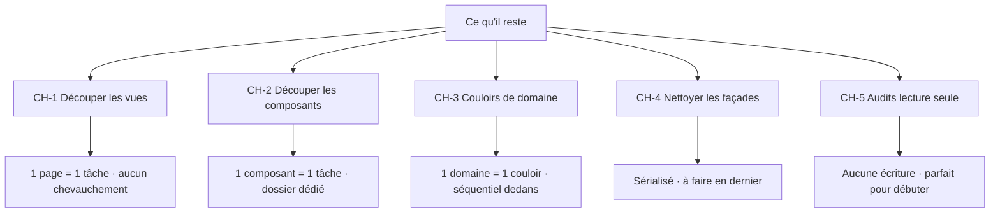

# Plan de travail — ce qu'il reste à faire

> **À qui s'adresse ce document.** Aux stagiaires (et à la personne qui les
> encadre) pour découper le travail restant en tâches **autonomes** qui ne
> produisent **aucun conflit** si plusieurs personnes travaillent en même temps.
>
> **À lire avant de commencer :** [`GUIDE_DECOUPAGE_COUCHES.md`](GUIDE_DECOUPAGE_COUCHES.md)
> (la stratégie et la recette). Ce document-ci est le **plan de travail**
> dérivé de ce guide et de l'état réel du code, mesuré le 2026-10-01.

---

## 1. Où en est le chantier (mesuré, pas supposé)

Audit réalisé sur le dépôt à la date ci-dessus :

| Constat | Résultat | Conséquence |
|---|---|---|
| SQL exécuté directement dans les contrôleurs (`src/app/api/**/route.js`) | **0** | Le gros du découpage de données est **terminé** |
| Enveloppes maison (`runSafeQuery`…) dans les routes | **0** | Idem |
| Fichiers de route contenant encore un mot-clé SQL | 4, tous **bénins** et documentés | Rien à extraire (voir §1.1) |
| SQL dans `src/lib` hors du moteur de base | **0** | L'infrastructure est propre |
| SQL dans les vues / composants | **0** | Les vues ne touchent jamais la base |
| Façades de compatibilité restantes | ~24 dans `src/models/**`, 57 dans `src/lib/**` | Reste à nettoyer (§5) |
| Plus gros fichiers de code | 1 page de **6 699 lignes**, 1 de 5 353, un composant de 4 884… | Cœur du travail restant (§3, §4) |
| Fichiers de route > 250 lignes | **36** | Frontière contrôleur encore à épaissir (§6) |
| Gros services > 400 lignes | ~19 | À découper (§6) |

**En une phrase :** le SQL est sorti partout. Ce qui reste est
(a) **découper les gros fichiers** (vues, contrôleurs, services) et
(b) **nettoyer les points d'entrée temporaires** (façades). Aucun de ces travaux
ne change le comportement de l'application.

### 1.1 Les 4 routes encore signalées (aucune action)

- `api/migrate/phase5` : endpoint de migration sanctionné (il exécute un fichier
  `.sql`, c'est son rôle).
- `api/attendance` et `api/invites` : un **fragment** de `WHERE` assemblé par le
  contrôleur puis passé au dépôt (mise en forme, pas décision), ou un simple
  commentaire.
- `api/ready` : un `SELECT 1` dans un commentaire.

À laisser tel quel. Ne pas « corriger » ces quatre fichiers.

---

## 2. La règle qui garantit zéro conflit

Un conflit (Git) n'arrive que lorsque **deux personnes modifient le même
fichier**. Toute la stratégie consiste donc à rendre les périmètres
d'écriture **disjoints**. Six règles suffisent :

1. **Un fichier existant = un seul propriétaire à la fois.** Aucune tâche ne
   doit lister un fichier déjà listé par une autre tâche en cours.
2. **Nouveaux fichiers → uniquement dans son propre dossier.** Chaque tâche
   crée ses nouveaux composants/services dans un dossier **à son nom**
   (ex. `src/components/pm/program/mon-dossier/`). On n'écrit jamais dans le
   dossier d'une autre tâche.
3. **Un « couloir de domaine » = un seul stagiaire.** Les tâches d'un même
   domaine de service partagent le barillet `src/services/<domaine>/index.js`.
   Un seul rédacteur par domaine → on prend un domaine entier, pas une tâche
   isolée dedans.
4. **Contrat d'API figé.** Les tâches de vue et de contrôleur **ne changent
   pas** la forme des réponses HTTP. Si une réponse doit changer, c'est une
   tâche à part, annoncée et séquencée.
5. **On ne touche pas aux fichiers hors de son périmètre.** Si un besoin
   ailleurs apparaît, on écrit une note pour le propriétaire, on ne l'édite pas.
6. **Les vues ne se privent pas de leur export public.** Quand on découpe un
   composant, son export public reste identique : les pages qui l'importent
   n'ont rien à changer.

### Le test avant de prendre une tâche

> Ouvrez la fiche de la tâche. Vérifiez que **aucun** des fichiers listés
> n'apparaît dans une autre fiche déjà « en cours ». Si c'est le cas, changez de
> tâche. Utilisez `grep` pour confirmer que vous êtes le seul à éditer ces
> fichiers.

### Une tâche = une branche = un petit commit

Une branche Git par tâche, un `git rebase` sur la branche commune avant de
pousser, une revue. Petit périmètre = revue rapide = zéro surprise.

---

## 3. Vue d'ensemble des chantiers



| Chantier | Principe de découpage | Parallélisable ? | Dépendances |
|---|---|---|---|
| **CH-1 — Vues (pages)** | 1 fichier = 1 tâche | ✅ Oui, totalement | Aucune |
| **CH-2 — Composants** | 1 composant (ou 1 zone couplée) = 1 tâche | ✅ Oui, totalement | Aucune |
| **CH-3 — Couloirs de domaine** | 1 domaine de service = 1 couloir (contrôleurs + gros services) | ✅ Entre couloirs, ⛔ pas dedans | Aucune |
| **CH-4 — Façades** | Par lot de modules | ⛔ Non (voir §5) | À faire **après** CH-1/2/3 |
| **CH-5 — Audits** | 1 rapport = 1 tâche | ✅ Oui | Aucune (lecture seule) |

---

## 4. CH-1 — Découper les vues

**But :** sortir la logique d'affichage des pages géantes vers des composants
réutilisables, **sans changer le rendu**. C'est de la dette de taille, pas un
changement fonctionnel.

**Périmètre :** uniquement le fichier `page.js` listé + un dossier de nouveaux
composants à vous.

**Règles :** i18n obligatoire via `t()` (voir `AGENTS.md`), variables CSS pour
les couleurs, `useDialogs()` pour les confirmations, aucun appel direct à la
base. Le rendu doit rester identique.

| ID | Fichier (périmètre exclusif) | LOC | Effort |
|---|---|---|---|
| V1 | `src/app/pm/programs/[id]/page.js` | 6 699 | XL |
| V2 | `src/app/platform/runs/page.js` | 5 353 | XL |
| V3 | `src/app/staff/op-report/page.js` | 4 019 | XL |
| V4 | `src/app/admin/op-reports/page.js` | 2 420 | L |
| V5 | `src/app/admin/page.js` | 2 050 | L |
| V6 | `src/app/platform/forms/page.js` | 1 979 | L |
| V7 | `src/app/team/[id]/page.js` | 1 807 | L |
| V8 | `src/app/admin/communications/contacts/page.js` | 1 543 | L |
| V9 | `src/app/s/[runId]/page.js` | 998 | M |
| V10 | `src/app/facilitator/program/[id]/page.js` | 951 | M |
| V11 | `src/app/investor/dashboard/page.js` | 948 | M |
| V12 | `src/app/admin/investors/relationships/page.js` | 947 | M |
| V13 | `src/app/admin/tasks/page.js` | 939 | M |
| V14 | `src/app/staff/projects/[id]/page.js` | 900 | M |
| V15 | `src/app/admin/platform/scores/page.js` | 894 | M |
| V16 | `src/app/admin/programs/**` (`page.js`, `new/page.js`, `[id]/page.js`) | 2 402 + 1 346 + 876 | XL |
| V17 | `src/app/admin/projects/**` (`page.js`, `[id]/page.js`) | 1 526 + 1 578 | XL |

> **Pourquoi V16 et V17 regroupent plusieurs fichiers :** ces pages d'un même
> dossier partageront probablement des composants. Les confier à une seule
> personne évite deux personnes dans le même dossier de composants.

**Nouveaux dossiers suggérés** (chaque tâche possède le sien) :
`src/components/pm/program/`, `src/components/platform/runs/`,
`src/components/staff/op-report/`, `src/components/admin/op-reports/`, etc.

**Terminé quand :** la page ne contient plus que l'orchestration et la mise en
page d'ensemble ; le rendu est identique ; les tests, le lint et le build sont
verts.

---

## 5. CH-2 — Découper les composants

**But et règles :** identiques à CH-1. Un composant gardé ici garde **son export
public** : les pages qui l'importent ne changent pas.

| ID | Fichier(s) (périmètre exclusif) | LOC | Effort |
|---|---|---|---|
| B1 | `src/components/layout/DashboardLayout.js` | 2 186 | XL |
| B2 | `src/components/tasks/TaskManager.js` | 2 510 | XL |
| B3 | `src/components/dashboard/UnifiedDashboard.js` | 1 919 | XL |
| B4 | `src/components/dashboard/ProgramDetail.js` | 1 288 | L |
| B5 | `src/components/dashboard/ProfileView.js` | 981 | M |
| B6 | `src/components/messaging/MessagingChat.js` | 1 549 | L |
| B7 | `src/components/ventures/JourneyManagerPanel.js` **et** `…/workspace/tabs/JourneyPlaybookTabs.js` | 2 617 + 654 | XL |
| B8 | `src/components/ventures/VentureDashboard.js` | 728 | M |
| B9 | `src/components/ventures/PlanImportPanel.js` | 1 182 | L |
| B10 | `src/components/permissions/PermissionCenter.js` | 4 884 | XL |
| B11 | `src/components/permissions/PeopleView.js` **et** `…/ProgramScopePanel.js` | 921 + 695 | L |
| B12 | `src/components/pm/FacilitatorsPanel.js` | 762 | M |
| B13 | `src/components/lms/SectionResourcesEditor.js` **et** `…/SectionsManager.js` | 742 + 714 | L |
| B14 | `src/components/crm/MembershipScreen.js` | 703 | M |

> **Pourquoi certains regroupent deux fichiers :** ils forment une zone couplée
> (l'un contient l'autre, ou partage ses sous-composants). Un seul propriétaire
> par zone évite de créer deux fois le même sous-composant.

**Astuce anti-conflit :** tous ces composants créent leurs nouveaux fichiers dans
un sous-dossier **à leur nom**. Ex. pour B10 : `src/components/permissions/permission-center/`.
Ainsi B10, B11 ne se marchent jamais dessus, même s'ils partagent le dossier
parent.

---

## 6. CH-3 — Couloirs de domaine (contrôleurs + gros services)

**But :** finir d'amaigrir les contrôleurs (sortir la décision vers
`src/services/<domaine>/`) et découper les gros fichiers de service.

**Principe anti-conflit :** un **couloir = un domaine de service** = un seul
stagiaire. Toutes les tâches d'un couloir se font **l'une après l'autre** (elles
partagent le barillet `src/services/<domaine>/index.js`). Les couloirs, eux,
tournent **en parallèle** : ils ne partagent aucun fichier.

**Méthode d'une tâche de contrôleur :** ouvrir la route, repérer ce qui est
*décision* (elle-même sur-ligne comme `if`, calculs, enchaînements) vs *transport*
(lecture des paramètres, réponse). Déplacer la décision dans le service, garder
la route mince, **ne pas changer la forme de la réponse**.

### Les couloirs disponibles

| Couloir | Routes (périmètre) | Gros services à découper |
|---|---|---|
| **L1 — platform** | `src/app/api/platform/**`, `src/app/api/s/public-submit/route.js` (502), `src/app/api/intents/route.js` (423) | `services/platform/formRuns.js` (2 133), `import.js` (609), `seed.js` (535), `report.js` (426) |
| **L2 — ventures** | `src/app/api/ventures/**` (`[id]/sessions` 555, `[id]/journey` 445, `[id]/members` 383, `[id]/tasks` 330, `[id]/deliverables` 309, `[id]/dashboard` 307, `[id]/milestones` 306, `[id]/plan-import` 284…) | `services/ventures/planImport.js` (1 178), `milestoneEngine.js` (548), `submissions.js` (526), `journey.js` (520), `verification.js` (487), `profile.js` (441), `schema.js` (410) |
| **L3 — tasks & blockers** | `src/app/api/tasks/**`, `src/app/api/blockers/route.js` (373) | `services/tasks/update.js` (730) |
| **L4 — programs** | `src/app/api/programs/**`, `src/app/api/v2/program-staff/route.js` (297), `src/app/api/participant/programs/[id]/route.js` (427) | `services/programs/workspace.js` (596), `curriculum.js` (539) |
| **L5 — authorization & access-profiles** | `src/app/api/access-profiles/**` (463 + 291) | `services/authorization/contextGrants.js` (538), `context.js` (560) |
| **L6 — lms & checkout** | `src/app/api/lms/**`, `src/app/api/public/checkout/route.js` (372) | `services/lms/learning.js` (601), `checkout.js` (500) |
| **L7 — contacts / CRM** | `src/app/api/contacts/**`, `src/app/api/people/**`, `src/app/api/families/**`, `src/app/api/contact-emails/**`, `src/app/api/groups/**`, `src/app/api/user-groups/**`, `src/app/api/group-members/**`, `src/app/api/segments/**`, `src/app/api/admin/bulk-upload/route.js` (277) | `services/contacts/**` |
| **L8 — communications** | `src/app/api/campaigns/**`, `src/app/api/internal-comms/**`, `src/app/api/announcements/**`, `src/app/api/followups/**`, `src/app/api/events/**` | `services/communications/internalComms.js` (412) |
| **L9 — workspace & calendrier** | `src/app/api/calendar/route.js` (443), `src/app/api/workspaces/route.js` (375) | `services/workspace/**` |
| **L10 — portail participant** *(domaine à ouvrir)* | `src/app/api/participant/**` (`home` 505, `progress` 450, `programs` 283) | créer `services/participant/**` |
| **L11 — investisseur** *(domaine à ouvrir)* | `src/app/api/investor/**` (`diligence` 285) | créer `services/investor/**` |
| **L12 — tableau de bord & ops admin** *(domaine à ouvrir)* | `src/app/api/dashboard/route.js` (560), `src/app/api/admin/**` (adminOps) | créer `services/dashboard/**` |

**Délimiter son couloir (à faire en premier) :** l'API compte une centaine de
dossiers de routes. Avant de commencer, listez les dossiers de votre couloir et
confirmez, pour chacun, vers quel domaine de service il pointe :

```sh
ls -d src/app/api/<votre-dossier>/*/ 2>/dev/null   # sous-dossiers du couloir
grep -rhoE 'from "@/models/[a-zA-Z0-9/_-]+' src/app/api/<votre-dossier>/ --include=route.js | sort -u
```

La seconde commande vous dit quels dépôts la route utilise : c'est là qu'ira la
décision. Écrivez la liste exacte des fichiers de votre couloir dans la fiche de
tâche avant d'éditer quoi que ce soit.

**Cas particulier à annoncer :** `src/app/api/workspaces/route.js` importe à la
fois le dépôt `investor` et le dépôt `workspace`. Il appartient au couloir **L9**.
Si L11 en a besoin, L11 attend que L9 ait fini sur ce fichier (relation
« fournisseur → client », à déclarer).

**Terminé quand :** la route ne fait plus qu'authentifier, valider et mettre en
forme ; la décision est dans le service correspondant ; aucun SQL dans le
service ; tests, lint, build verts.

---

## 7. CH-4 — Nettoyer les façades (à faire en dernier, sérialisé)

Les **façades** sont les points d'entrée temporaires qui réexportent un module
déplacé. Il en reste :

- **~24 façades de modèle** dans `src/models/**` (ex. `authorization/resolver.js`,
  `finance/queries.js`, `lms/learning.js`, `communications.js`, `contacts.js`,
  `formRuns.js`, `workspace.js`…).
- **57 façades** dans `src/lib/**` (autorisation, lms, plateforme, finance…).

**Pourquoi c'est sérialisé et fait en dernier :** supprimer une façade oblige à
modifier *les lignes d'import* de tous ses utilisateurs, qui sont dispersés dans
des pages et des routes — donc exactement les fichiers des chantiers CH-1/2/3.
Deux personnes éditant les imports du même fichier = conflit. **Une seule
personne à la fois**, après les autres chantiers.

**Méthode par module :**
1. `grep` tous les importateurs de la façade.
2. Réécrire chaque import vers le nouveau chemin (`@/services/...` ou
   `@/models/...`).
3. `npm test`, `npx eslint .`, `npm run build`.
4. Supprimer la façade seulement si `grep` ne trouve plus aucun importateur.
5. Mettre à jour `docs/LAYER_SPLIT.md`.

**Origine des listes :**
```sh
grep -rlnE 'export \* from "@/(models|services)' src/lib
grep -rlnE 'from "@/services' src/models
```

> Note : les façades **ne coûtent rien** à l'exécution. Ce chantier est un
> nettoyage de lisibilité, pas une nécessité : il peut attendre.

---

## 8. CH-5 — Audits (lecture seule, idéal pour débuter)

Ces tâches **n'écrivent rien** : aucun risque de conflit, parfaites pour un
premier jour.

| ID | Livrable | Méthode |
|---|---|---|
| A1 | Rapport « aucun module de modèle ne mélange décision et requête » | Passer les modèles > 600 lignes (`authorization/backfill.js`, `authorization.js`, `curriculum.js`, `platform/automation.js`, `investorRelations.js`, `contacts.js`…) et vérifier qu'aucune fonction ne combine un `if` métier et du SQL |
| A2 | Rapport « aucun SQL dans les mauvaises couches » | Relancer les 3 commandes de l'audit (§1) ; confirmer 0/0 |
| A3 | Rapport « les garde-fous passent » | Lancer `src/__tests__/server/services-boundaries.test.js` et expliquer ce qu'il protège |

---

## 9. Attribution parallèle (exemple pour 6 stagiaires)

Chaque colonne = une personne. Aucune colonne ne partage de fichier avec une
autre. On avance **de haut en bas** dans sa colonne.

| Stagiaire 1 | Stagiaire 2 | Stagiaire 3 | Stagiaire 4 | Stagiaire 5 | Stagiaire 6 |
|---|---|---|---|---|---|
| A1 (audit, échauffement) | A2 (audit) | V1 (page PM programmes) | B1 (DashboardLayout) | **L2 — ventures** | **L1 — platform** |
| V3 (op-report staff) | V2 (platform runs) | B10 (PermissionCenter) | B2 (TaskManager) | *(suite L2)* | *(suite L1)* |
| … | … | … | … | … | … |

**Règles d'attribution :**
- Une personne qui prend un **couloir** (L1…L12) le garde jusqu'au bout : c'est
  son domaine.
- Les tâches **V** et **B** sont interchangeables entre personnes : chacune est
  une île.
- Après CH-1/CH-2/CH-3, **une seule** personne prend CH-4 (façades).

**Pour passer à l'échelle :** dupliquer les colonnes V et B (il y en a 17 + 14),
et ouvrir les couloirs L4…L12. Chaque nouvelle personne prend une ligne libre.

---

## 10. Points de coordination (les seuls fichiers partagés)

| Fichier partagé | Qui peut y écrire | Protocole |
|---|---|---|
| `src/services/<domaine>/index.js` | Le propriétaire **unique** du couloir | Personne d'autre n'y touche ; un couloir = une personne |
| Composants partagés déjà existants (ex. `src/components/layout/DashboardLayout.js`) | La tâche B1 uniquement | Les autres ne l'éditent pas ; en cas de besoin, note au propriétaire |
| `docs/LAYER_SPLIT.md` | La·le responsable du chantier | Mettre à jour **à la fin** de sa tâche, en une section |
| `package.json`, config lint/build | **Personne** (hors tâche dédiée) | Changement = tâche annoncée |

**Règle générale :** si vous devez éditer un fichier qui n'est pas dans la liste
de votre tâche, **arrêtez et prévenez** au lieu d'éditer.

---

## 11. Définition de « terminé » (commune à toutes les tâches)

- [ ] Le comportement est **identique** (aucun changement fonctionnel).
- [ ] Le fichier de départ a **rétréci** ; les nouveaux fichiers sont dans mon
      dossier dédié.
- [ ] Les règles projet respectées : `t()` pour tout texte, couleurs en
      variables CSS, `useDialogs()` pour les confirmations, aucune vue ne touche
      la base.
- [ ] `npm test` vert.
- [ ] `npx eslint .` — 0 erreur.
- [ ] `npm run build` vert.
- [ ] `docs/LAYER_SPLIT.md` (ou le journal concerné) mis à jour si la couche a
      changé.
- [ ] Un seul commit/branche, périmètre = la fiche de tâche.

---

## 12. Ordre conseillé

1. **CH-5 (audits)** — échauffement, zéro risque.
2. **CH-1 et CH-2 (vues et composants)** — en parallèle, largement suffisant
   pour occuper plusieurs personnes sans aucun conflit.
3. **CH-3 (couloirs de domaine)** — en parallèle, un couloir par personne.
4. **CH-4 (façades)** — en dernier, par une seule personne.

Tant que les périmètres de §2 sont respectés, l'ordre entre chantiers n'a pas
d'importance : ils ne se croisent pas.
