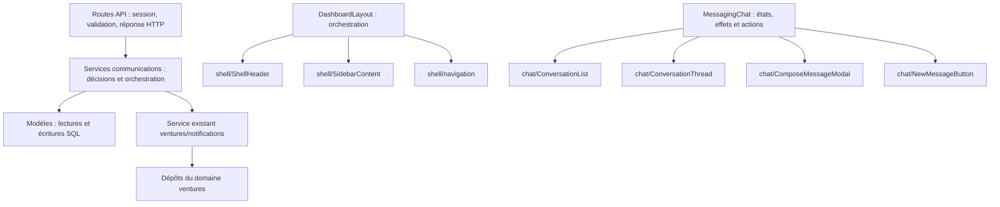

# Rapport technique — Refactoring communications et coquille — Christelle

Date : 2 octobre 2026. Tâches : **L8, B1, B6**.

## 1. Objectif et état du livrable

La mission consistait à terminer le déplacement des décisions du couloir
communications vers les services, à découper `DashboardLayout.js` et à découper
`MessagingChat.js`. Les points d'entrée publics et le rendu devaient être conservés.

Le découpage et les modifications décrits ici sont présents dans le workspace.
**La validation finale n'est pas achevée : les derniers tests et le build ne
peuvent pas être déclarés verts.** Le détail des constats à arbitrer est dans
[POINTS_LEAD_COMMUNICATIONS_Christelle.md](POINTS_LEAD_COMMUNICATIONS_Christelle.md).

Ce rapport décrit l'état local ; il ne constitue ni une preuve de déploiement,
ni un compte rendu de production test.

## 2. Travail préexistant repris

Au début de l'intervention, le workspace contenait déjà les modifications suivantes,
présentées par l'utilisatrice comme du travail réalisé avec Claude :

| Fichier | État au démarrage |
| --- | --- |
| `src/app/api/campaigns/route.js` | Modifié |
| `src/app/api/campaigns/[id]/route.js` | Modifié |
| `src/services/communications/campaigns.js` | Modifié |
| `src/__tests__/campaigns-service.test.js` | Nouveau fichier non suivi par Git |
| `src/__tests__/internal-comms-service.test.js` | Nouveau fichier non suivi par Git |

Ces changements ont été conservés. Ils sont inclus dans le bilan final du couloir,
mais ne doivent pas être attribués à cette intervention comme des créations nouvelles.

Le service de campagnes existant à la reprise compose notamment la création,
la mise à jour de définition, le chargement du détail et les comptes livrés.
Les routes restent désactivées par `RETIRED = true`.

## 3. Architecture retenue

Les services modifiés ne contiennent pas de SQL ajouté et ne construisent pas de
réponses `NextResponse`. Ils renvoient des valeurs de décision ou des résultats
que les contrôleurs sérialisent. Les lectures simples d'événements, suivis et
campagnes peuvent encore passer directement du contrôleur au dépôt.

## 4. L8 — Messagerie interne

### 4.1 Point d'entrée conservé

`src/services/communications/internalComms.js` est désormais un point d'entrée
de réexport. Il conserve les fonctions publiques :

- `resolveProgramMemberIds` ;
- `resolveGroupMemberIds` ;
- `resolveUserMessageScope` ;
- `recipientSharesProgram` ;
- `mayReadInbox` et `readMessageInbox` ;
- `sendInternalMessage` ;
- `markMessagesRead`.

La route `src/app/api/internal-comms/route.js` n'a pas été modifiée : ses imports
continuent de fonctionner via ce point d'entrée.

### 4.2 Répartition des responsabilités

| Nouveau fichier | Contenu déplacé |
| --- | --- |
| `src/services/communications/internal-comms/scope.js` | Résolution des membres de programme/groupe, périmètre de l'utilisateur et partage de programme |
| `src/services/communications/internal-comms/inbox.js` | Autorisation de lecture d'une boîte et lecture des messages visibles |
| `src/services/communications/internal-comms/send.js` | Contrôle de l'émetteur, restrictions de cible, création et notifications associées |
| `src/services/communications/internal-comms/read.js` | Participation à la conversation, marquage lu et synchronisation des notifications |

Les appels aux dépôts, les branches de décision, l'ordre des opérations et les
comportements de tolérance aux erreurs ont été conservés lors du déplacement.
Les requêtes concurrentes de résolution du périmètre étaient déjà présentes et
n'ont pas été introduites par ce chantier.

### 4.3 Contrats conservés

Le service continue de retourner `{ id }` pour l'envoi, `{ ok: true }` pour le
marquage lu et `{ denied: { error, status } }` pour les refus concernés.
Les restrictions des envois non super administrateurs restent liées aux groupes,
programmes et relations de messagerie existants.

Le défaut de vérification des identifiants dans la branche de marquage `messageIds`
reste présent et est explicitement signalé au lead ; ce rapport ne revendique
pas une correction de sécurité sur ce point.

## 5. L8 — Suivis

### Fichiers modifiés

- `src/app/api/followups/route.js` ;
- `src/services/communications/followups.js`.

### Décisions extraites

`evaluateFollowupParticipantAccess` remplace la composition des décisions dans
la route : accès des rôles de gestion, présence d'un programme, évaluation de
l'affectation via `evaluateAssignmentAccess`, résolution de l'équipe et contrôle
d'appartenance du participant.

Le service utilise la primitive de décision située derrière l'ancien garde HTTP
`requireAssignmentAccess`. Il renvoie `{ allowed, status, errorKey }` ; le
contrôleur construit la réponse JSON.

`updateScopedFollowup` lit le suivi, contrôle le programme et le participant
stockés pour une modification, puis appelle `updateFollowupRecord` uniquement
après autorisation. La lecture simple de la liste reste dans le contrôleur via
`listFollowups`.

### Comportements conservés

- Les validations de champs et les rôles déclarés avec `createHandler` restent dans la route.
- Les refus restent sérialisés avec les mêmes clés d'erreur et statuts.
- Les requêtes d'appartenance pour création et mise à jour restent distinctes.
- La création de suivi, l'événement calendrier et le déplacement de soumission ne sont pas réécrits.
- L'identifiant de suivi inexistant conserve son succès historique après mise à jour de zéro ligne.

## 6. L8 — Notifications générales

### Fichiers modifiés

- `src/app/api/notifications/route.js` ;
- `src/services/communications/inboxNotifications.js`.

### Fonctions ajoutées au service

| Fonction | Responsabilité |
| --- | --- |
| `readNotificationInbox` | Choix du destinataire, lecture des non-lus, marquage vu, compte indépendant et regroupement facultatif |
| `publishInboxNotification` | Contrôle du destinataire demandé et création d'une notification |
| `applyInboxNotificationAction` | Contrôle d'existence et de propriété avant marquage lu, refus des actions inconnues |

Les helpers de décision déjà présents restent exportés : sélection du destinataire,
autorisations, sélection des non-lus, collecte des identifiants et conversion du compte.

### Comportements conservés

La route conserve l'authentification et la dégradation gracieuse lorsque celle-ci
échoue à la lecture. Le service conserve la tolérance aux erreurs de lecture,
les erreurs ignorées du marquage vu et le repli sur la taille de la liste lorsque
la requête du compte échoue.

Le nombre du badge reste issu d'un compte indépendant de la page de notifications.
Le marquage « vu » reste distinct du marquage « lu ». Le regroupement par contexte
reste un champ additionnel demandé par `group_by=context`.

## 7. L8 — Notifications ventures

### Fichiers modifiés

- `src/app/api/notifications/venture/route.js` ;
- `src/services/communications/ventureNotifications.js`.

### Répartition

`readVentureNotificationCenter` distribue les demandes de liste, compte des non-lus,
modèles, préférences et détail. `actOnVentureNotification` distribue le marquage lu,
le marquage global, l'archivage, la suppression, l'envoi de test et les préférences.

La route conserve la session et une fonction `respond` qui transforme un résultat
ou un refus en réponse HTTP. Le service appelle directement
`src/services/ventures/notifications`, qui était déjà la destination de la façade
`@/lib/ventures` utilisée auparavant. Aucun fichier du domaine ventures n'est modifié.

Les règles existantes `resolveNotificationRecipient` et `canAccessNotification`
restent publiques. Les valeurs par défaut de pagination, les contrôles de
propriété et les messages d'erreur sont conservés.

## 8. B1 — Découpage de DashboardLayout

### Fichier principal modifié

`src/components/layout/DashboardLayout.js` conserve son export par défaut,
son `PermissionProvider`, les états, les effets, la session, les capacités,
les fetchers de badges, la navigation calculée et la mise en page générale.

### Nouveaux fichiers

| Fichier | Responsabilité |
| --- | --- |
| `src/components/layout/shell/SidebarContent.js` | Rendu de navigation, menus, survol, rail replié, profil et actions latérales |
| `src/components/layout/shell/ShellHeader.js` | Fil d'Ariane, sélecteurs, cloche, aperçu des notifications et accès mobile |
| `src/components/layout/shell/navigation.js` | Correspondance des libellés, fil d'Ariane et calcul des branches actives |

Les blocs reçoivent les valeurs et callbacks du parent. L'extraction n'ajoute pas
de conteneur DOM. Les états locaux de menus et de survol de la barre latérale
restent dans `SidebarContent`, comme dans la définition du composant avant extraction.

Aucun layout de section n'a changé d'import ou de structure. Les classes,
textes et actions existants ont été déplacés sans retouche fonctionnelle.
Les non-conformités i18n historiques sont signalées au lead séparément.

## 9. B6 — Découpage de MessagingChat

### Fichier principal modifié

`src/components/messaging/MessagingChat.js` conserve son export par défaut,
les états de conversation/composition, l'identité de session, les lectures API,
le polling conditionné par la visibilité, les regroupements, les comptes non-lus,
les actions d'envoi, les pièces jointes et les références du fil/compositeur.

### Nouveaux fichiers

| Fichier | Responsabilité |
| --- | --- |
| `src/components/messaging/chat/ConversationList.js` | Recherche, états chargement/vide, liste de conversations et badges |
| `src/components/messaging/chat/ConversationThread.js` | Fil actif, messages, pièces jointes et formulaire de réponse |
| `src/components/messaging/chat/ComposeMessageModal.js` | Fenêtre de nouveau message, cibles, contenu et pièces jointes |
| `src/components/messaging/chat/NewMessageButton.js` | Action d'ouverture et réinitialisation de la composition |
| `src/components/messaging/chat/getPermissions.js` | Calcul des contacts, groupes, programmes et modes accessibles dans l'interface |
| `src/components/messaging/chat/formatTime.js` | Formatage historique des dates/heures affichées |
| `src/components/messaging/chat/cn.js` | Assemblage des classes conditionnelles |

Les permissions côté interface restent une aide à l'affichage ; elles ne remplacent
pas les contrôles serveur. Elles ont été déplacées, sans redéfinition des droits.
Les références sont transmises aux composants qui rendent les éléments concernés.

## 10. Tests ajoutés et adaptés

### Nouveau fichier créé pendant cette intervention

`src/__tests__/communications-orchestration.test.js` ajoute **10 cas de test**,
en comptant les trois variantes du test paramétré. Les cas couvrent :

1. Le destinataire imposé pour une personne non privilégiée, la sélection des non-lus et le compte indépendant.
2. Les erreurs du marquage vu et du compte, avec conservation de la liste et du repli.
3. Le refus de création ou modification dans la boîte d'une autre personne avant écriture.
4. Les refus de marquage lu, archivage et suppression ventures avant mutation — trois cas.
5. La pagination par défaut et le compte indépendant de la liste ventures.
6. Le refus d'affectation avant résolution de l'équipe d'un suivi.
7. Le contrôle du programme et du participant stockés avant mise à jour d'un suivi.
8. Le comportement historique d'un suivi inexistant.

Les dépôts et dépendances d'autorisation y sont simulés. Ces tests ne valident
pas le schéma ni des requêtes sur une base réelle.

### Tests structurels adaptés

| Fichier | Adaptation |
| --- | --- |
| `src/__tests__/identity-gate-bridge.test.js` | Pour les suivis, contrôle l'appel du service et sa primitive d'affectation ; conserve l'assertion historique pour les sessions |
| `src/__tests__/sidebar-menu.test.js` | Lit le composant principal et la barre latérale extraite pour les contrats de survol et d'expansion |
| `src/__tests__/notification-badge.test.js` | Lit le composant principal et l'en-tête extrait pour les contrats de badge et d'aperçu |

Les tests `campaigns-service.test.js` et `internal-comms-service.test.js` étaient
déjà présents au démarrage ; ils n'ont pas été créés pendant cette reprise.

## 11. Documentation modifiée et créée

| Fichier | Intervention |
| --- | --- |
| `src/services/communications/index.js` | Commentaires de cartographie actualisés ; exports publics conservés |
| `src/services/communications/README.md` | Nouveau document : liste des dix routes, destinations et responsabilités du couloir |
| `docs/LAYER_SPLIT.md` | Section ajoutée sur les déplacements L8/B1/B6 |
| `DESIGN_SYSTEM.md` | Section ajoutée sur les blocs internes de coquille et messagerie |
| `docs/POINTS_LEAD_COMMUNICATIONS_Christelle.md` | Nouveau livrable : constats, risques hérités et actions proposées au lead |
| `docs/RAPPORT_TECHNIQUE_COMMUNICATIONS_Christelle.md` | Nouveau livrable : présent rapport technique |

## 12. Inventaire et taille des fichiers principaux

Tailles mesurées sur le workspace et comparées à `HEAD`, en lignes physiques.
La réduction vient principalement de déplacements : elle ne signifie pas que
les fonctionnalités correspondantes ont été supprimées.

| Fichier | Avant (`HEAD`) | Après |
| --- | ---: | ---: |
| `src/components/layout/DashboardLayout.js` | 2 186 | 1 187 |
| `src/components/messaging/MessagingChat.js` | 1 549 | 786 |
| `src/services/communications/internalComms.js` | 412 | 5 |
| `src/app/api/followups/route.js` | 156 | 91 |
| `src/app/api/notifications/route.js` | 163 | 82 |
| `src/app/api/notifications/venture/route.js` | 114 | 25 |

Au total, cette intervention a créé **18 nouveaux fichiers dans le dépôt** :
3 blocs/helpers de coquille, 7 blocs/helpers de chat, 4 modules de messagerie
interne, 1 fichier de tests, 1 README et 2 livrables documentaires.
Les deux fichiers de tests déjà présents à la reprise ne sont pas comptés dans
ces 18 créations.

Les fichiers déjà suivis modifiés pendant cette intervention sont les trois routes
suivis/notifications, les deux composants principaux, les cinq fichiers de services
`followups.js`, `inboxNotifications.js`, `index.js`, `internalComms.js` et
`ventureNotifications.js`, les trois tests structurels et les deux documents
partagés. Les trois fichiers de campagnes modifiés avant la reprise sont conservés.

Des scripts temporaires de découpage, nettoyage des imports et comparaison AST
ont aussi été utilisés dans `/tmp`. Ils ne sont pas des fichiers du projet,
ni des dépendances à intégrer ou nécessaires à l'exécution de l'application.

## 13. Vérifications réalisées et limites

### Comparaison des blocs rendus

Un script temporaire a analysé le JSX avec Babel, réintégré les éléments retournés
par les sous-composants extraits et comparé les arbres aux fichiers de `HEAD`,
sans tenir compte des positions et commentaires. Le JSX retourné par
`DashboardLayoutInner` et `MessagingChat` était identique.

Cette preuve concerne la structure des blocs copiés. Elle ne constitue pas un
test de navigateur, ne valide pas les réseaux et ne prouve pas à elle seule
l'absence de régression d'interaction.

### Résultats des commandes

| Commande ou contrôle | Résultat et limite |
| --- | --- |
| `npm run lint` | Première exécution : 0 erreur, 5 avertissements dans `YouTubePlayer.js` et `useApi.js` ; elle ne couvre pas tous les changements ultérieurs |
| `npm test` | Première exécution : 251 suites, 248 réussies, 3 échouées ; 3 663 tests, 3 658 réussis, 5 échoués |
| Corrections des tests structurels | Effectuées après cette exécution ; résultat final de la relance non confirmé |
| Nouveau fichier de tests d'orchestration | Écrit après la première exécution ; ne pas le déclarer validé sans relance |
| `npm run build` | Compilation de production lancée ; résultat final non récupéré après interruption |
| `git diff --check` | Aucun problème de whitespace détecté sur l'état contrôlé |

Le lanceur Node/npm via Snap échouait dans le bac à sable. Des commandes ont été
relancées avec une demande d'exécution hors bac à sable ; aucune modification
de dépendances ou de configuration du projet n'a été faite pour contourner cela.

### Travail restant pour clôturer

1. Exécuter `npm test`, `npm run lint` et `npm run build` sur l'état final et enregistrer leurs résultats.
2. Vérifier en navigateur la navigation, le rail replié, le tiroir mobile et les menus de survol.
3. Vérifier la cloche, son aperçu et le rafraîchissement des non-lus.
4. Vérifier recherche, ouverture de conversation, réponse, composition, pièces jointes et affichage mobile.
5. Vérifier les refus des opérations de messagerie/suivis/notifications avec plusieurs rôles.
6. Faire examiner les points hérités décrits dans le document destiné au lead.

## 14. Périmètre préservé

Aucun fichier `src/app/**/layout.js`, aucun composant de
`src/components/dashboard/**`, aucun modèle SQL, aucune migration, aucune locale,
aucune dépendance et aucune configuration lint/build n'a été modifié.

Certaines routes conservent leurs appels historiques `initDb` et imports de
`@/lib/db` ; cette reprise n'est donc pas une suppression générale de ces imports.
Aucune modification de base, promotion de branche, publication ou production test
n'a été effectuée. Les changements restent locaux, sans commit réalisé pendant
cette intervention.
