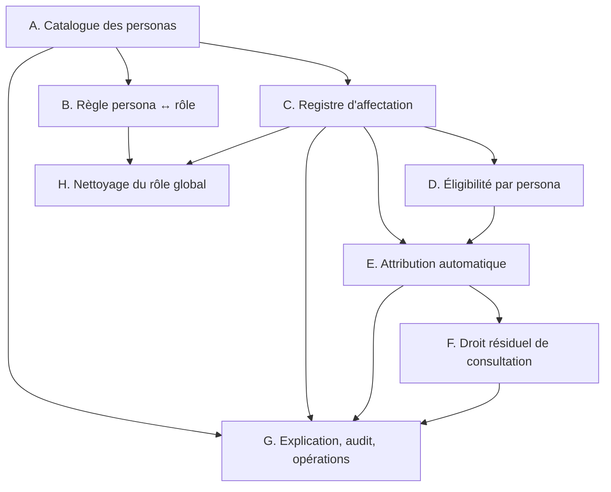

# Feuille de route — Rôles, personas, éligibilité, permissions et affectations

> Statut : proposée — exécutable, additive et réversible.
> Portée : faire du **persona** un objet de premier ordre, l'intégrer à
> l'éligibilité, unifier l'**affectation** (dates, source, contexte, historique)
> et distinguer l'accès actif de l'accès de consultation résiduel.
>
> Prérequis de lecture : `docs/AUTHZ_CURRENT_STATE.md`,
> `docs/IDENTITY_CONTEXT_MIGRATION.md`, `docs/IDENTITY_I1_DECISIONS.md`,
> `docs/PHASE4_CONTEXT_ROLE_PROFILES.md`, `docs/PHASE6_CONTEXT_GRANT_APPLICATION.md`,
> `docs/PHASE5_SCOPE_ENGINE.md`, `docs/ASSIGNMENT_ACCESS_MODEL_ADR.md`,
> `docs/LAYER_SPLIT.md`, `docs/MVC_REFACTOR.md`.

---

## 0. Règles de conduite (non négociables)

1. **Additif uniquement.** On ajoute des mécanismes à côté des existants ; rien
   n'est remplacé tant que l'équivalence n'est pas prouvée.
2. **Zéro perdant.** Chaque phase préserve ce que les personnes ont aujourd'hui.
   Toute activation d'un comportement automatique est précédée d'un rapport
   « qui perdrait l'accès » qui doit être vide.
3. **Réversible.** Chaque phase est annulable sans opération de données inverse.
4. **Une source de vérité par concept.** Le rôle = identité de base
   (`contacts.role`) ; le persona = fonction contextuelle ; les tables métier
   restent la source du contexte. Le registre d'affectation *décrit*, il ne
   décide pas seul de l'accès.
5. **Prudence par défaut.** L'éligibilité et la portée continuent de refuser en
   cas de doute. Un refus explicite l'emporte. Le Super Admin reste hors plafond.
6. **Aucune décision d'administration écrasée** par un remplissage automatique
   (`ON CONFLICT DO NOTHING` partout, marqueur de migration propre).

---

## 1. Vue d'ensemble

| Phase | Objectif | Dépend de | Livrable principal |
|---|---|---|---|
| **A** | Catalogue des personas | — | Table `personas`, catalogue pur, API + écran Personas |
| **B** | Règle persona ↔ rôle (avertissement) | A | Décision pure + signalement dans les rapports |
| **C** | Registre d'affectation unifié | A | Table `persona_assignments`, écriture/lecture, écran par personne |
| **D** | Éligibilité par persona | C | `identity_type = 'persona'` reconnu par l'éligibilité |
| **E** | Attribution automatique généralisée | C, D | Couples (contexte, persona) branchés sur les processus métier |
| **F** | Droit résiduel de consultation | C, E | Accès `*.view` post-expiration, borné au contexte |
| **G** | Explication, audit, opérations | A–F | Explication « pourquoi », journal d'audit, opérations |
| **H** | Nettoyage du rôle global + blocage strict | B, C, E | `contacts.role` = identité de base seule |

> **Ordre révisé par rapport au plan initial.** Le registre d'affectation (C)
> passe **avant** l'éligibilité par persona (D), car D a besoin de connaître les
> personas *actives* d'une personne, information que C fournit. L'éligibilité
> étendue (ex-C) devient donc D.



---

## 2. Portes de vérification (à chaque phase)

Aucune phase n'est « terminée » sans ces quatre preuves :

| Porte | Ce qu'on vérifie |
|---|---|
| **Rejeu** | Rejouer la phase ne produit aucun changement (idempotence). |
| **Équivalence** | Le rapport « qui perdrait l'accès » est vide avant toute activation. |
| **Non-régression** | La suite `src/__tests__/` reste verte ; `npm run lint` = 0 erreur. |
| **Documentation** | `docs/AUTHZ_CURRENT_STATE.md` mis à jour (statut de la phase) et, si le vocabulaire change, `.ai/MEMORY.md`. |

---

## 3. Phase A — Catalogue des personas

**But.** Le persona devient un objet nommé, administrable, avec son contexte et
ses rôles autorisés.

**Livrable.** Table `personas`, catalogue pur, service, API d'administration et
écran « Personas ».

**Prérequis.** Aucun.

**Étapes.**

1. Schéma — nouveau `src/models/authorization/personasStore.js` avec
   `ensurePersonasSchema()` (auto-réparation idempotente, même patron que
   `ensureContextRoleProfilesSchema`) :

   ```sql
   CREATE TABLE IF NOT EXISTS personas (
     id SERIAL PRIMARY KEY,
     key TEXT NOT NULL UNIQUE,
     context TEXT NOT NULL,
     allowed_roles JSONB NOT NULL DEFAULT '[]',
     is_active INTEGER NOT NULL DEFAULT 1,
     notes TEXT DEFAULT '',
     created_at TIMESTAMP WITH TIME ZONE DEFAULT NOW(),
     updated_at TIMESTAMP WITH TIME ZONE DEFAULT NOW()
   );
   CREATE INDEX IF NOT EXISTS idx_personas_context ON personas(context);
   ```

2. Catalogue pur — nouveau `src/models/authorization/persona-catalog.js`
   (sans import de base, partageable avec les composants d'écran, comme
   `eligibility-defaults.js`). Sept personas :

   | key | context | allowed_roles |
   |---|---|---|
   | `participant` | `program` | `[member]` |
   | `learner` | `lms` | `[member]` |
   | `founder` | `venture` | `[member]` |
   | `investor` | `investor` | `[member]` |
   | `facilitator` | `program` | `[staff, member]` |
   | `program_manager` | `program` | `[staff]` |
   | `venture_manager` | `venture` | `[staff]` |

   `PERSONA_CONTEXTS` réutilise les valeurs de `CONTEXT_ROLE_CONTEXTS`
   (`program`, `venture`, `lms`, `investor`). Exporter `PERSONA_CATALOG`,
   `PERSONA_CONTEXTS`, `PERSONA_KEYS`, `PERSONA_BASELINE_ROLES`.

   **Libellés = clés i18n, jamais du texte stocké.** Chaque persona porte une
   `labelKey` (`engineering.permissions.persona<Nom>`) résolue par `t()` en
   anglais et en français, comme le catalogue des capacités. C'est pourquoi la
   table n'a PAS de colonne `label` : un libellé stocké ne pourrait pas être
   traduit.

3. Remplissage initial — `seedPersonaCatalog()` avec
   `INSERT ... ON CONFLICT (key) DO NOTHING`. Enregistré une seule fois par base
   via `runAuthzMigration("personas-catalog-v1", seedPersonaCatalog)` dans
   `src/models/authorization/backfill.js`.

4. Service — `src/services/authorization/personaCatalog.js` : validation
   (`isValidPersonaKey`, `isValidPersonaContext`, `allowed_roles ⊆
   BASELINE_IDENTITIES`), lecture de liste, upsert.

5. Contrôleur — `src/app/api/engineering/permissions/personas/route.js`
   (GET liste, PUT upsert), gardé par la capacité existante
   `permissions.configure_eligibility` (`src/server/authz/responses.js`).

6. Vue — `src/components/permissions/PersonasView.js`, affichée comme TROISIÈME
   sous-onglet de la porte « Rules » (`eligibility/page.js` → `sub=personas`).
   La porte « Where it applies » a déjà ses trois sous-onglets et la règle
   « jamais plus de 3 » interdit d'en ajouter un quatrième ; un onglet de plus
   sous « Rules » reste dans la limite, et « qui peut porter quoi » est
   précisément une règle. Ajouter l'onglet dans
   `src/components/permissions/permissionNav.js`.

**Opérations de données.** Création de table + lignes de catalogue uniquement.

**Tests.** Catalogue pur (sept personas, contextes, rôles autorisés) ;
auto-réparation du schéma ; route GET/PUT ; rejeu sans changement.

**Acceptation.** Sept personas visibles avec contexte et rôles autorisés ;
l'administration peut modifier `allowed_roles` et `is_active`.

**Retour arrière.** Supprimer la route, la vue et l'entrée de navigation ; la
table reste inoffensive.

---

## 4. Phase B — Règle persona ↔ rôle (avertissement)

**But.** La restriction « ce persona n'est ouvert qu'à ces rôles de base »
devient une règle observable, **sans blocage** tant que l'historique n'est pas
nettoyé (Phase H).

**Livrable.** Décision pure + signalement dans les rapports d'attribution.

**Prérequis.** A.

**Étapes.**

1. Décision pure — dans `src/services/authorization/personaCatalog.js` :

   ```js
   // { allowed: boolean, reason: 'ok' | 'role-not-allowed' | 'persona-inactive' }
   export function evaluatePersonaRoleFit(persona, role) { ... }
   ```

2. Points de contrôle (mode avertissement) : le chemin d'attribution
   automatique (`src/services/authorization/contextGrantReconcile.js`) et
   l'attribution manuelle par responsabilité
   (`src/services/authorization/responsibilityAssignment.js`) consignent un
   écart dans leur rapport ; l'accès n'est pas modifié.

3. Exposer l'écart dans le rapport de l'API d'administration des personas.

4. Préparer l'interrupteur : une constante `PERSONA_ROLE_ENFORCEMENT`
   (`"warn"` par défaut, `"block"` après H), lue par les deux points de
   contrôle.

**Opérations de données.** Aucune.

**Tests.** `evaluatePersonaRoleFit` (cas autorisé / refusé / persona inactif) ;
le rapport contient l'écart ; en mode `warn`, aucune révocation.

**Acceptation.** Attribuer `program_manager` à une personne de rôle `member`
produit un écart signalé, sans retirer d'accès.

**Retour arrière.** Retirer les appels de contrôle.

---

## 5. Phase C — Registre d'affectation unifié

**But.** Une fiche répond à « quels personas cette personne a-t-elle eus, sur
quelles périodes, dans quel contexte, et à quelle source ».

**Livrable.** Table `persona_assignments`, écriture/lecture, écran par personne.

**Prérequis.** A.

**Étapes.**

1. Schéma — nouveau `src/models/authorization/personaAssignmentsStore.js` :

   ```sql
   CREATE TABLE IF NOT EXISTS persona_assignments (
     id SERIAL PRIMARY KEY,
     contact_cid TEXT NOT NULL REFERENCES contacts(cid) ON DELETE CASCADE,
     persona_key TEXT NOT NULL,
     context_type TEXT NOT NULL,
     context_id TEXT,
     started_at TIMESTAMPTZ NOT NULL DEFAULT NOW(),
     ends_at TIMESTAMPTZ,
     status TEXT NOT NULL DEFAULT 'active',   -- active | ended | revoked
     source TEXT NOT NULL DEFAULT 'manual',   -- manual | automatic
     source_ref TEXT,                          -- ex. cid de l'auteur, ou code de la relation
     notes TEXT DEFAULT '',
     created_by TEXT,
     created_at TIMESTAMP WITH TIME ZONE DEFAULT NOW(),
     ended_at TIMESTAMPTZ
   );
   CREATE INDEX IF NOT EXISTS idx_persona_assignments_lookup
     ON persona_assignments(contact_cid, persona_key, status);
   CREATE INDEX IF NOT EXISTS idx_persona_assignments_context
     ON persona_assignments(context_type, context_id) WHERE status = 'active';
   ```

2. Lecture — dans le même store :
   - `listPersonaAssignments(cid)` (toutes périodes, plus récentes d'abord) ;
   - `listActivePersonaKeys(cid)` (actives, non expirées) — **la lecture que D
     consomme** ;
   - `listAssignmentsForContextAndPersona(contextType, contextId, personaKey)`.

3. Décision — `src/services/authorization/personaAssignments.js` :
   `deriveAssignmentSource(relationship)` (mapping relation → source/context),
   normalisation des dates, règle « une période = une fiche » (une réactivation
   crée une **nouvelle** fiche, ne réécrit jamais l'ancienne).

4. Écriture manuelle — `src/app/api/engineering/permissions/persona-assignments/route.js`
   (GET par personne, POST attribuer, PATCH clôturer). Gardé par
   `permissions.assign_responsibilities` (ou une capacité dédiée à décider).

5. Vue — section « Personas » dans l'écran par personne
   (`src/components/permissions/permission-center/`, écran « Person Access ») :
   liste des personas avec période, contexte et source ; bouton d'attribution
   manuelle.

**Opérations de données.** Création de table. Aucun backfill à ce stade : les
fiches des relations existantes sont produites en Phase E (attribution
automatique) et par un remplissage de rattrapage.

**Tests.** `listActivePersonaKeys` exclut les fiches expirées et révoquées ;
réactivation = deux fiches distinctes ; dates invalides rejetées.

**Acceptation.** Pour une personne, on lit l'ensemble de ses personas passés et
présents avec leurs périodes, y compris un même persona deux fois.

**Retour arrière.** Ignorer la table ; aucune autre phase n'a encore de
dépendance dure.

---

## 6. Phase D — Éligibilité par persona

**But.** L'éligibilité accepte un troisième type d'identité : le persona.

**Livrable.** `identity_type = 'persona'` reconnu de bout en bout (configuration
et décision).

**Prérequis.** C.

**Étapes.**

1. Vocabulaire — `src/services/authorization/eligibilityAdmin.js` :
   `IDENTITY_TYPES = ["role", "group", "persona"]`. `validateEligibilityChanges`
   accepte `persona` et valide la clé contre `PERSONA_KEYS`. Les listes
   `BASELINE_IDENTITIES` / `CONTEXT_ROLES` restent le vocabulaire produit ; le
   persona devient une identité distincte, jamais confondue avec un rôle.

2. Lecture — `src/models/authorization/contextReads.js` :
   `getFeatureEligibilityRows(role, groups, personas)` ajoute les lignes de type
   `persona` pour les personas fournis. Aucun changement de schéma : la table
   `feature_eligibility` porte déjà `identity_type`/`identity_value`.

3. Résolution — `src/services/authorization/contextResolver.js` :
   `resolveAuthorizationContext` lit `listActivePersonaKeys(cid)` (Phase C) et le
   passe à la lecture d'éligibilité. **La clé du cache doit inclure les personas
   actives**, et toute écriture de `persona_assignments` doit invalider le cache
   (`invalidateAuthorizationContext(cid)`), sinon une éligibilité change sans
   effet visible.

4. Plafond des modèles — `assertTemplateCapsEligible({ role, groups, personas,
   profileId })` et `assertAssignmentEligible` (`src/services/authorization/
   profileAssignment.js`) intègrent les personas, pour que
   `ELIGIBLE ≠ GRANTED` reste vrai au niveau du persona.

5. Écran — l'onglet « Rules / Ceilings »
   (`src/app/admin/security/permissions/eligibility/page.js`,
   `src/components/permissions/FeatureMatrixSection.js`) gagne la ligne persona.

**Opérations de données.** Aucune obligatoire. Optionnel : amender
`FEATURE_ELIGIBILITY_DEFAULTS` (`src/models/authorization/eligibility-defaults.js`)
et `RESPONSIBILITY_FEATURE_ROLES` (`src/lib/featureAccess.js`) — les deux doivent
rester synchrones (test d'alignement existant).

**Tests.** Une section ouverte à `member` seul refuse `member + founder` si la
ligne persona n'existe pas ; l'ajout de la ligne persona l'autorise. Le cache est
invalidé sur écriture d'affectation.

**Acceptation.** On peut écrire « Membre + persona Fondateur » et distinguer ce
cas de « Membre » seul, sans régression pour les lignes rôle/groupe existantes.

**Retour arrière.** Retirer le type `persona` du vocabulaire ; les lignes
persona restent inertes.

---

## 7. Phase E — Attribution automatique généralisée

**But.** Créer une relation métier crée la fiche d'affectation **et** applique
les droits ; la retirer retire exactement ce qui a été appliqué.

**Livrable.** Couples (contexte, persona) branchés sur les processus métier,
tracés et réversibles.

**Prérequis.** C, D.

**Étapes.**

1. Déclarer les couples — `src/services/authorization/contextGrantPlan.js`,
   `SUPPORTED_CONTEXT_ROLES` : ajouter, dans l'ordre de maturité, les couples
   approuvés (voir tableau). Les trois couples existants restent la référence :
   `{venture, founder}`, `{program, facilitator}`, `{program, program_manager}`.

2. Justification — `src/services/authorization/contextGrantJustification.js` :
   un branchement par nouveau couple, avec la relation qui le justifie et la
   règle de fin :

   | Couple | Relation justificative | Fin |
   |---|---|---|
   | `{venture, team_member}` | `venture_members` (`member_type = 'team_member'`, `removed_at IS NULL`) | retrait de la relation |
   | `{investor, investor}` | tables investisseur (`investor_profiles` / relations) | retrait de la relation |
   | `{lms, learner}` | `lms_enrollments` (`status <> 'suspended'`) | désinscription |
   | `{venture, venture_manager}` | **à définir** (décision produit) | retrait de la relation |

3. Lectures de population — `src/models/authorization/contextGrantsStore.js` et
   `src/models/authorization/programAssignmentReads.js` : une lecture
   « tout le monde portant ce couple » par couple, pour le balayage.

4. Règles héritées à conserver (pinnées par les tests existants) :
   **additif** (jamais de baisse), **marque d'origine** `ctx:<context>:<role>`
   seule motif de retrait (un droit manuel n'est jamais touché), **réversible**.

5. Fiche d'affectation — au moment d'appliquer, écrire/actualiser la fiche
   `persona_assignments` (`source = 'automatic'`, `source_ref` = code de la
   relation) ; au retrait, passer la fiche en `status = 'ended'`,
   `ended_at = NOW()` (jamais de suppression).

6. Branchement métier — appeler la réconciliation depuis les écritures de
   relation existantes (comme en Phase 6 pour les fondateurs) : création /
   modification / retrait de la relation, fusion de contacts, plus le balayage
   périodique existant.

7. **Activation couple par couple**, chacun précédé du rapport d'équivalence
   (porte §2). Ne pas activer un couple dont une correspondance de modèle est
   encore vide (aujourd'hui `venture:team_member`, `lms:learner`).

**Opérations de données.** Le remplissage de rattrapage existant
(`GET /api/engineering/permissions/sync-context-grants`) crée les fiches
manquantes et applique les droits ; idempotent.

**Tests.** Par couple : application → rejeu sans changement → retrait exact ;
« droit manuel jamais écrasé » ; rapport d'équivalence vide.

**Acceptation.** Pour chaque couple activé : aucune personne ne perd d'accès, le
rejeu est neutre, et le retrait de la relation retire exactement les droits
appliqués et clôt la fiche.

**Retour arrière.** Retirer le couple de `SUPPORTED_CONTEXT_ROLES` ; le balayage
remet les anciens appliqués.

---

## 8. Phase F — Droit résiduel de consultation

**But.** Un ancien gestionnaire conserve la **lecture** de ce qu'il a géré,
sans les droits de gestion. Aujourd'hui l'expiration retire tout.

**Livrable.** Accès `*.view` post-expiration, borné au contexte et à la période.

**Prérequis.** C, E.

**Étapes.**

1. Mode sur les droits appliqués — `src/models/authorization/contextGrantsStore.js` :
   `ALTER TABLE context_applied_grants ADD COLUMN IF NOT EXISTS mode TEXT NOT NULL
   DEFAULT 'active'` (`active` | `historical`). Une marque d'origine distincte
   pour l'historique : `hist:<context>:<role>`.

2. Deux notions distinctes : **persona actif** (droits de gestion) et **relation
   passée** (droits de consultation). À l'expiration, on retire les droits de
   gestion et on accorde un plafond de lecture (`<module>.view` au niveau 1)
   limité au contexte de l'affectation.

3. Dérivation — nouveau branchement dans
   `src/services/authorization/contextGrantJustification.js` (ou un module frère
   `contextGrantHistory.js`) qui, à partir des fiches `status = 'ended'`,
   calcule les droits de lecture résiduels.

4. Portée — `src/models/authorization/scope-catalog.js` et
   `src/models/authorization/scopeReads.js` : nouvelles politiques
   `venture_managed_history` et `program_managed_history` (base : fiches
   `persona_assignments` terminées + `contact_roles` `is_current = false`),
   `implemented: true`. Brancher dans `src/services/authorization/scope.js`.

5. Séparabilité — le balayage doit pouvoir retirer l'historique seul, sans
   toucher aux droits actifs, et inversement. Le retrait manuel de l'historique
   doit être possible (décision produit).

**Décisions produit requises.** Portée des champs lisibles ; durée (permanente
ou limitée) ; révocabilité manuelle.

**Opérations de données.** Ajout de colonne ; `mode = 'active'` par défaut, donc
aucun changement de comportement pour les lignes existantes.

**Tests.** Après fin d'affectation : lecture du contexte autorisée, modification
refusée, autres contextes inaccessibles ; le retrait de l'historique ne touche
pas les droits actifs.

**Acceptation.** L'ancien gestionnaire lit le programme concerné, ne peut ni le
modifier ni voir les autres.

**Retour arrière.** Désactiver le branchement historique ; la colonne reste.

---

## 9. Phase G — Explication, audit et opérations

**But.** L'administration comprend et pilote tout depuis l'interface.

**Livrable.** Explication intégrée, journal d'audit, opérations.

**Prérequis.** A–F.

**Étapes.**

1. Explication — `src/services/authorization/contextDecisions.js`,
   `buildPermissionExplanation` : intégrer personas et affectations (source,
   période, contexte) à côté des sources existantes (modèle, groupe, droits
   individuels). Écran : panneau d'explication existant du centre de permissions.

2. Audit — `permission_audit_log` : tracer attribution, retrait, expiration et
   changement de règle persona (auteur, cible, motif). Écran « History ».

3. Opérations — `src/components/permissions/OperationsView.js` +
   `src/app/admin/security/permissions/operations/page.js` : ajouter
   « re-dériver les droits depuis les relations » (inclut désormais les fiches
   personas) et « qui perdrait l'accès » (colonne persona + fiche).

4. Vue des affectations — l'écran par personne affiche période, contexte, source
   et état (actif / terminé / révoqué).

**Tests.** L'explication couvre persona + affectation + rôle ; l'audit contient
une entrée par écriture ; le rapport « qui perdrait l'accès » reste vide en
régime normal.

**Acceptation.** Chaque écran est atteignable en deux clics au plus depuis le
centre de permissions.

**Retour arrière.** Réduire aux écrans existants.

---

## 10. Phase H — Nettoyage du rôle global + blocage strict

**But.** Le rôle ne porte plus que l'identité de base ; la règle persona ↔ rôle
passe de l'avertissement au blocage.

**Livrable.** `contacts.role ∈ {super_admin, staff, member}` de fait ;
`PERSONA_ROLE_ENFORCEMENT = "block"`.

**Prérequis.** B, C, E.

**Étapes.**

1. Preuve de zéro dépendance — s'appuyer sur l'inventaire des mutations de rôle
   (`docs/IDENTITY_CONTEXT_MIGRATION.md` §C, `identity-role-writes.test.js`) et
   sur un relevé des comptes portant encore une valeur de persona héritée.

2. Lecture seule prolongée, puis alignement vers l'identité de base **seulement
   après preuve**. Aucune suppression d'historique : les relations et les fiches
   personas portent déjà l'information.

3. Blocage strict — passer `PERSONA_ROLE_ENFORCEMENT` à `"block"` : attribuer un
   persona à un rôle non autorisé est refusé (avertissement de Phase B devenu
   refus).

4. Nettoyage du vocabulaire — retirer des listes de rôles les valeurs de persona
   (les personas vivent dans leur catalogue) ; mise à jour de
   `FEATURE_ELIGIBILITY_DEFAULTS`, `RESPONSIBILITY_FEATURE_ROLES`, masques de
   navigation.

**Opérations de données.** Alignement de `contacts.role` pour les comptes
hérités, insert-only côté relations, jamais de suppression.

**Tests.** Plus aucun accès ne dépend d'une valeur héritée ; la suite de
non-régression reste verte ; refus effectif en mode `block`.

**Acceptation.** Le rôle est une identité de base pour tous ; les personnes
concernées gardent tout via leurs personas.

**Retour arrière.** Repasser `PERSONA_ROLE_ENFORCEMENT` à `"warn"` ; les valeurs
héritées n'ont pas été supprimées.

---

## 11. Décisions produit (bloquantes)

| # | Décision | Bloque |
|---|---|---|
| D1 | La règle persona ↔ rôle : avertissement d'abord, blocage en H ? | B |
| D2 | `program_manager` réservé au Staff, ou un Membre explicitement désigné ? | A, B |
| D3 | `facilitator` : rôles autorisés (Staff, Membre, ou les deux) ? | A |
| D4 | `venture_manager` : relation justificative et contexte ? | E |
| D5 | Couples automatiques à activer, et dans quel ordre ? | E |
| D6 | Droit résiduel : portée, durée, révocabilité manuelle ? | F |
| D7 | Valeurs de rôle héritées : lecture seule prolongée ou alignement ? | H |

---

## 12. Journal de suivi

| Phase | Statut | Responsable | Date | Preuve (rapport / test) |
|---|---|---|---|---|
| A — Catalogue des personas | Fait | | 2026-10-05 | 18 tests (`persona-catalog-phase-a`) ; lint 0 erreur |
| B — Règle persona ↔ rôle | À faire | | | |
| C — Registre d'affectation | À faire | | | |
| D — Éligibilité par persona | À faire | | | |
| E — Attribution automatique | À faire | | | |
| F — Droit résiduel de consultation | À faire | | | |
| G — Explication, audit, opérations | À faire | | | |
| H — Nettoyage du rôle global | À faire | | | |

---

## 13. Ce que l'on ne touche pas

- Le moteur de décision existant : éligibilité → droits → blocages → portée, et
  la règle « un blocage gagne toujours, et retire le droit plutôt que de le
  baisser » (pinné par `src/__tests__/authorization-resolver.test.js`).
- Les tables métier comme source du contexte (`participant_programs`,
  `v2_program_staff`, `v2_teams`, `venture_members`, `lms_enrollments`, tables
  investisseur, `contact_roles`).
- Les modèles de droits existants (`access_profiles` +
  `access_profile_capabilities`) et leurs niveaux.
- Les mécanismes historiques tant que l'équivalence n'est pas prouvée
  (stratégie venture, `docs/AUTHZ_CURRENT_STATE.md` §3).
- Le socle MVC : SQL dans `src/models/**` uniquement, décisions dans
  `src/services/**`, contrôleurs fins dans `src/app/api/**`
  (`docs/MVC_REFACTOR.md`, `docs/LAYER_SPLIT.md`).
